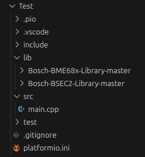
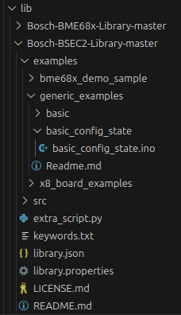
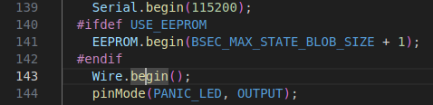
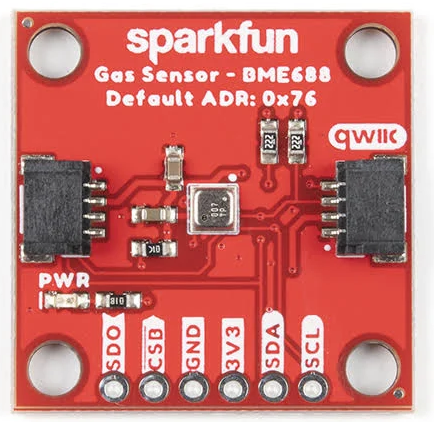

## Beer AI
This document aims to assist in bootstrapping the project to a state from which it is easy to continue. It focuses on getting your IDE to a state where you can start coding as soon as possible, instead of spending time on other things.

### Requirements
We used VS Code and its plugin platformIO to compile code to ESP-32. If you wish to follow this document, it is neccesary for you to use both in order to follow this guide. While you can flash the ESP-32 without either, this document wont be covering that.

We used ESP-32 as our board, but it should be fine to use S2 variant. For greater detail on which boards are supported in the eventuality no baseline ESP-32's are available, you should read the documentation on Bosch's end, as we are using two of their libraries.

The libraries can be found at https://github.com/boschsensortec/Bosch-BSEC2-Library/tree/master/ and https://github.com/boschsensortec/Bosch-BME68x-Library/tree/master . Do take note that they might have changed since we worked on it, so the copy of Bosch's git that we used might be what you need to study instead. You will need a physical copy of the gits on the computer that is compiling the binary for the ESP-32. The libraries we used are included, in case something major gets changed.

### VS Code
Directly from microsoft for the lazy. Its normal to not see feedback from the lines that arent using apt.
```
sudo apt-get install wget gpg
wget -qO- https://packages.microsoft.com/keys/microsoft.asc | gpg --dearmor > packages.microsoft.gpg
sudo install -D -o root -g root -m 644 packages.microsoft.gpg /etc/apt/keyrings/packages.microsoft.gpg
echo "deb [arch=amd64,arm64,armhf signed-by=/etc/apt/keyrings/packages.microsoft.gpg] https://packages.microsoft.com/repos/code stable main" |sudo tee /etc/apt/sources.list.d/vscode.list > /dev/null
rm -f packages.microsoft.gpg


sudo apt install apt-transport-https
sudo apt update
sudo apt install code # or code-insiders
```

### PlatformIO
In VS Code, press
```
Ctrl + Shift + X
```
In the search bar, type platformio. You should see the following


Install it. This may take a while and usually requires a restart.

```
Ctrl + Shift + P
>Reload Window
```
Once installed, create a new project. Select the board that you are using.

A platformio.ini file should be created based on what you select. It should look something like this (board and platform vary depending on what you select):

```
; PlatformIO Project Configuration File
;
;   Build options: build flags, source filter
;   Upload options: custom upload port, speed and extra flags
;   Library options: dependencies, extra library storages
;   Advanced options: extra scripting
;
; Please visit documentation for the other options and examples
; https://docs.platformio.org/page/projectconf.html

[env:upesy_wroom]
platform = espressif32
board = upesy_wroom
framework = arduino
```

Add the following line to this configuration file if terminal (COM) readings are unintelligible. Adjust the baud rate accordingly if you touch it in the code.

```
monitor_speed = 115200
```

To add the dependancy libraries for the compiler, add the following line to the config file :

```
lib_deps =
    bsec2
    bme68xLibrary
```

After that, copy the contents of each git under lib.

It should show something like this :



Now, the binary itself where you make changes is the main.cpp file. 

Now would be a good time to make sure that everything works.

Replace the contents of main.cpp with basic_config_state.ino. This can be found under BSEC2 library.



Don't forget to add the physical pins that you connect to the ESP-32 to the code.



The correct order of pins in the I2C initialization function is SDA (data) into SCL (clock). You can ignore SDO and CSB pins for now. Their use is for SPI communication configurations.



While main.cpp is selected, build and upload the file. There are UI buttons for these, but in case you cant find them use the following :
```
Alt + Ctrl + B #Build
Alt + Ctrl + U #Upload
```
After that, open terminal and ensure that you can see some sensor readings.
```
Ctrl + Alt + S #Serial
```

And you're done! 


### Libraries
The libraries provide some interfaces through which you can access sensor readings. It is also possible to directly access the registers and read the values from the registers themselves. 

The basic_config_state.ino is utilizing a config file that has the neural network coefficients in a text file (This can be found under Bosch-BSEC2-Library-master/src/config/FieldAir_HandSanitizer). Using Bosch's AI Studio, the resulting output of trained neural network would be a .c and .h file. You can use that instead or you can manually create a text file and replace the testing coefficients. This way you can do the inference on the ESP-32 with minimal code changes, however you are tied to Bosch's AI studio this way.

If you wish to see more than what the basic_config_state.ino is printing, take a look at the keywords.txt files in both libraries. In the BME68X library you can use a getter function to populate a struct and then print the struct values. In the case where you wish to create your own neural network, you would want to only read the sensor values, send and store them to a database for training.

```
#Example code, will not work as is

Bme68x bme;

void setup(void) {}

void loop(void) {
    bme68xData data;
    bme68xHeatrConf HeaterConfig = bme.getHeaterConfiguration(); 

    if (bme.fetchData(data)) {
        Serial.println(data.temperature); #Prints temperature field from bme68xData struct
        Serial.println(HeaterConfig.heatr_dur); #Prints heater duration field from bme68xHeatrConf struct
    }

}

```

### WiFi
Credentials for the wifi to use on this project are as follows
```
REDACTED
```

To publish over mqtt your sensor readings, you could do something like this:

```
#Original code by Nikolai Haatanen, this is altered version

#include "Arduino.h"
#include "bme68xLibrary.h"
#include <Wire.h>
#include <WiFi.h>
#include "PubSubClient.h"

const char* ssid = "REDACTED";
const char* password = "REDACTED";

const char* mqtt_server = "127.0.0.1"; // Define the MQTT broker IP address
const char* mqtt_topic = "/bme688/gas"; // Define the MQTT topic
const char* mqtt_user = ""; // Define the MQTT username
const char* mqtt_pass = ""; // Define the MQTT password
const char* mqtt_port = "1883"; // Define the MQTT port

// Create a WiFi client and a PubSubClient instance
WiFiClient espClient;
PubSubClient client(espClient);

//Initialize the sensor instance
Bme68x bme;

// Function to set up WiFi connection
void setup_wifi() {
  delay(10);
  Serial.println();
  Serial.print("Connecting to WiFi");

  // Connect to WiFi using the provided credentials
  WiFi.mode(WIFI_STA);
  WiFi.begin(ssid, password);

  // Wait for the WiFi connection to be established
  while (WiFi.status() != WL_CONNECTED) {
    delay(500);
    Serial.print(".");
  }

  Serial.println("");
  Serial.println("WiFi connected");
  Serial.println("IP address: ");
  Serial.println(WiFi.localIP());
}

void setup() {
    //Configure the sensor as desired (I2C, SPI, BME68X or BSEC2)

    setup_wifi();
    client.setServer(mqtt_server, atoi(mqtt_port)); // Convert mqtt_port to integer
}

// Function to reconnect to the MQTT broker if the connection is lost
void reconnect() {
  while (!client.connected()) {
    Serial.print("Attempting MQTT connection...");
    
    // Attempt to connect to the MQTT broker with the given client ID, username, and password
    if (client.connect("ESP32Client", mqtt_user, mqtt_pass)) {
      Serial.println("connected");
    } else {
      // Print an error message and retry after 1 second if the connection attempt fails
      Serial.print("failed, rc=");
      Serial.print(client.state());
      Serial.println(" try again in 1 second");
      delay(1000);
    }
  }
}

void loop() {
  bme68xData data;

  // If the MQTT client is not connected, attempt to reconnect
  if (!client.connected()) {
    reconnect();
  }

  // Maintain the MQTT connection and handle incoming messages
  client.loop();
  char message1[50] = ""; // Initialize a buffer for MQTT messages
  char message2[50] = ""; // Initialize a buffer for MQTT messages
  
  // Fetch sensor data
  if (bme.fetchData()){
    bme.getData(data);
    status = (data.status);  
    if (status == 176){
      temperature = data.temperature;
      pressure = data.pressure;
      humidity = data.humidity;
      gasresistance = data.gas_resistance;
      String(gasresistance).toCharArray(message1, sizeof(message1));
      String(temperature).toCharArray(message2, sizeof(message2));
      
      // Publish a message to the specified MQTT topic
      client.publish(mqtt_topic, message1);      
      Serial.print("gas resistance: "); 
      Serial.print(message1);

      // Publish a message to the specified MQTT topic      
      client.publish(mqtt_topic, message2); 
      Serial.print(", temperature: "); 
      Serial.print(message2);
      Serial.print(", ");
    }

    Serial.print("status: ");
    Serial.println(status, HEX);
  
  }

  delay(60000);

}


```
