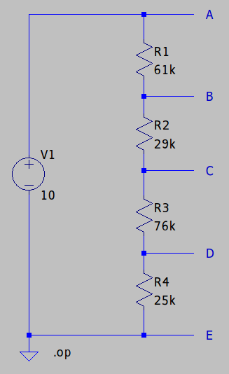
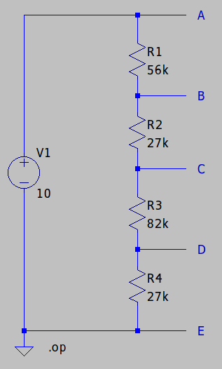
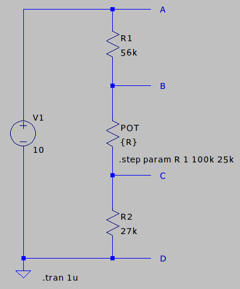
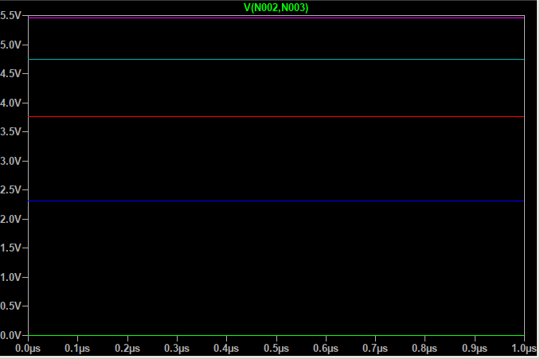

# LAB 01 - DC Circuits

*Felix Collin & Daniel Kortesmaa*

## Setup 1

### Instructions

Create a tapped voltage divider, where the values of the resistors R1-R4 depend on your and your teammate's student number.

Use Vs = 10V. Calculate the voltages on tapping points B, C and D. 

Create a simulation model in LTSpice and verify your calculations.

### Schematics

### Calculated values

*Resistance*

Rtot = R1 + R2 + R3 + R4 = 61 k&Omega; + 29 k&Omega; + 76 k&Omega; + 25 k&Omega; = 191 k&Omega;

*Current*

I = U/R = 10 V / 191 k&Omega; ≈ 0.0523560 mA

*Voltage drops*

VAB = 61 k&Omega; * 0.0523560 mA ≈ 3.19 V

VBC = 29 k&Omega; * 0.0523560 mA ≈ 1.51 V

VCD = 76 k&Omega; * 0.0523560 mA ≈ 3.98 V

*Voltages on the tapping points B, C, and D*

B = V1 - VAB ≈ 10 V - 3.19 V ≈ 6.81 V

C = B - VBC ≈ 6.81 V - 1.51 V ≈ 5.30 V

D = C - VCD ≈ 5.30 V - 3.98 V ≈ 1.32 V

### Simulation

B ≈ 6.81 V

C ≈ 5.29 V

D ≈ 1.31 V

## Setup 2

### Instructions

Replace the resistor values with the closest ones found in E12 series. Simulate again and observe the difference.

### Schematics

### Calculated values

*Resistance*

Rtot = R1 + R2 + R3 + R4 = 56 k&Omega; + 27 k&Omega; + 82 k&Omega; + 27 k&Omega; = 192 k&Omega;

*Current*

I = U/R = 10 V / 192 k&Omega; ≈ 0.0520833 mA

*Voltage drops*

VAB = 56 k&Omega; * 0.0520833 mA ≈ 2.92 V

VBC = 27 k&Omega; * 0.0520833 mA ≈ 1.41 V

VCD = 82 k&Omega; * 0.0520833 mA ≈ 4.27 V

*Voltages on the tapping points B, C, and D*

B = V1 - VAB ≈ 10 V - 2.92 V ≈ 7.08 V

C = B - VBC ≈ 7.08 V - 1.41 V ≈ 5.67 V

D = C - VCD ≈ 5.67 V - 4.27 V ≈ 1.40 V

### Simulation

B ≈ 7.08 V

C ≈ 5.68 V

D ≈ 1.41 V

### Measured values

*Voltage drops*

VAB ≈ 3.15 V

VBC ≈ 1.41 V

VCD ≈ 4.02 V

VDE ≈ 1.37 V

*Voltages on the tapping points A, B, C, and D*

A = 10.13 V

B = 6.86 V

C = 5.47 V

D = 1.39 V

## Setup 3

### Instructions

Replace resistors R2 and R3 with a potentiometer, which value is either 10 k&Omega; or 100 k&Omega;, which one is closer to the sum of values of resistors R2 and R3. 

Observe the range of voltage adjustment.

### Schematics

### Calculated values

The range of voltage adjustment can be observed by using the minimum and maximum values of the potentiometer.

***Minimum values***

*Resistance*

Rtot = R1 + RPOT + R2 = 56 k&Omega; + 0 &Omega; + 27 k&Omega; =  83 k&Omega;

*Current*

I = U/R = 10 V / 83 k&Omega; ≈ 0.1204819 mA

*Voltage drops*

VAB = 56 k&Omega; * 0.1204819 mA ≈ 6.75 V

VBC = 0 &Omega; * 0.1204819 mA = 0 V

VCD = 27 k&Omega; * 0.1204819 mA ≈ 3.25 V

*Voltages on the tapping points B and C*

B = V1 - VAB ≈ 10 V - 6.75 V ≈ 3.25 V

C = B - VBC ≈ 3.25 V - 0 V ≈ 3.25 V

***Maximum values***

*Resistance*

Rtot = R1 + RPOT + R2 = 56 k&Omega; + 100 k&Omega; + 27 k&Omega; =  183 k&Omega;

*Current*

I = U/R = 10 V / 183 k&Omega; ≈ 0.0546448 mA

*Voltage drops*

VAB = 56 k&Omega; * 0.0546448 mA ≈ 3.06 V

VBC = 100 k&Omega; * 0.0546448 mA ≈ 5.46 V

VCD = 27 k&Omega; * 0.0546448 mA ≈ 1.48 V

*Voltages on the tapping points B and C*

B = V1 - VAB ≈ 10 V - 3.06 V ≈ 6.94 V

C = B - VBC ≈ 6.94 V - 5.46 V ≈ 1.48 V

### Simulation

The simulation was performed by sweeping the resistance of POT. The start value was set to 1 &Omega; and the end value to 100 k&Omega; with the increment of 25 k&Omega;. This resulted to five measured values on VBC as shown in the figure above.

The range of VBC is:
- min: 0 V
- max: 5.46 V

### Measured values

***Minimum values***

Measured minimum resistance of the potentiometer: 13.6 &Omega;

*Voltage drops*

VAB ≈ 7.00 V

VBC ≈ 75 mV

VCD ≈ 3.22 V

*Voltages on the tapping points B and C*

B ≈ 3.22 V

C ≈ 3.22 V

***Maximum values***

Measured maximum resistance of the potentiometer: 94.3 k&Omega;

*Voltage drops*

VAB ≈ 3.39 V

VBC ≈ 5.07 V

VCD ≈ 1.53 V

*Voltages on the tapping points B and C*

B ≈ 6.51 V

C ≈ 1.51 V

## Used equipment in laboratory measurements

- PicoScope 2000 Series Oscilloscope
- Zhongyi ZY-206H Powered Breadboard