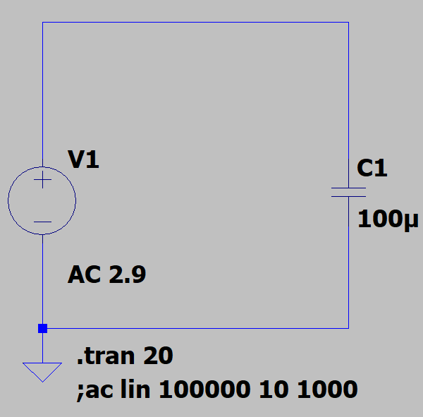
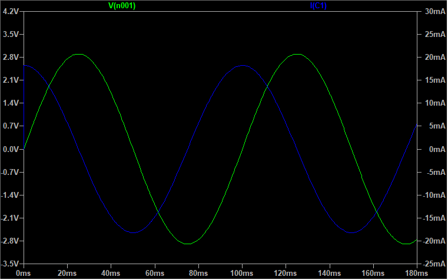
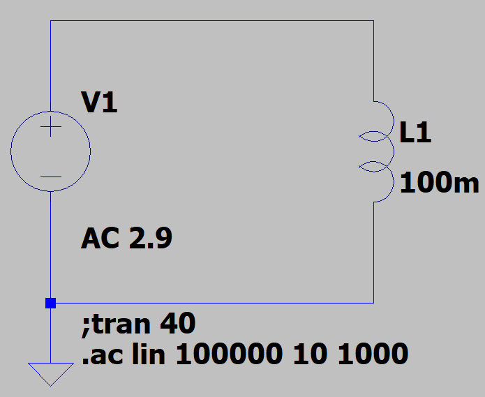
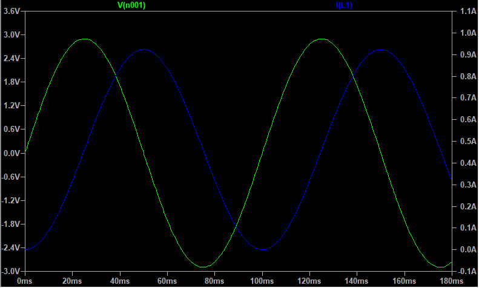
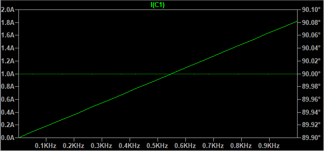
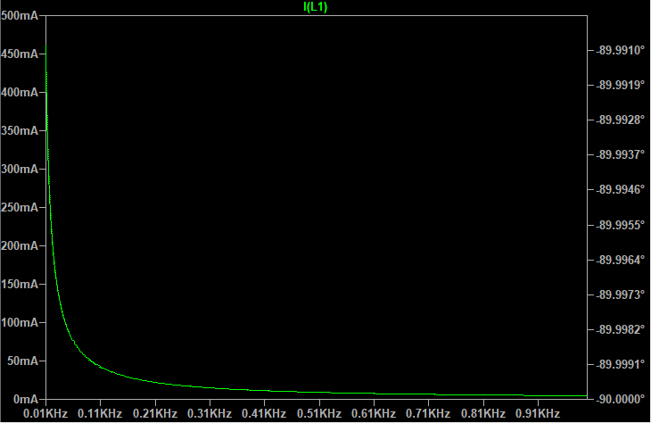
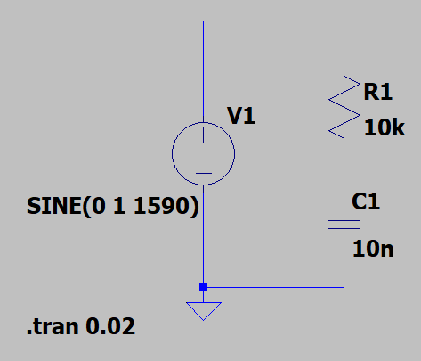
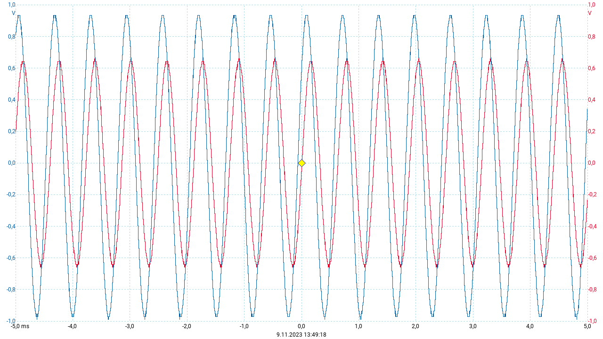

# LAB 02 - AC Circuits

*Felix Collin & Daniel Kortesmaa*

## Task 1

### Instructions

Create a circuit with an AC voltage supply, with following parameters: 

- The voltage (amplitude) is 2 last numbers of you student number, scaled so that it will fall between 0 and 10 volts. 
- There is a single capacitor connected to the circuit of value 100uF. 

Measure (in simulator) the voltage and current of the capacitor at 3 different frequencies: 10Hz, 100Hz, 1kHz 
 
Background theory here: https://www.electronics-tutorials.ws/accircuits/ac-capacitance.html 

### Schematics

### Simulation

| Frequency | UC |  IC1 |
|-----------|:-------------:|:---------------:|
| 10 Hz     |  &pm; 2.90 V  |  &pm; 17.9 mA   |
| 100 Hz    |  &pm; 2.90 V  |  &pm; 179 mA    |
| 1 kHz     |  &pm; 2.90 V  |  &pm; 1.79 A    |

As the figure below shows, current leads voltage by 90 degrees.

## Task 2

Create a circuit with an AC voltage supply, with following parameters: 

- The voltage (amplitude) is 2 last numbers of you student number, scaled so that it will fall between 0 and 10 volts. 
- There is a single inductor connected to the circuit of value 100mH. 

Measure (in simulator) the voltage and current of the capacitor at 3 different frequencies: 10Hz, 100Hz, 1kHz  

Background theory here: https://www.electronics-tutorials.ws/accircuits/ac-inductance.html

### Schematics

### Simulation

| Frequency | UC |       IL1     |
|-----------|:-------------:|:------------------------:|
| 10 Hz     |  &pm; 2.90 V  | From -370 mA to 485 mA   |
| 100 Hz    |  &pm; 2.90 V  | From -36.6 mA to 48.6 mA |
| 1 kHz     |  &pm; 2.90 V  | From -3.66 mA to 4.86 mA |

As the figure below shows, voltage leads current by 90 degrees.

## Task 3

Change the simulation type to AC analysis and observe the behaviour of capacitor and inductor currents as a function of frequency.

### Simulations

#### Capacitor

As the figure above shows, the growth of current corresponds linearly to the increasement of frequency.

#### Inductor

As the figure above shows, the current decreases as the frequency grows. The change is nonlinear.

# Lab procedure

## Instructions
In the simulation part, we were using an ideal signal generator, which has zero output impedance. In reality, the signal generators always have some output impedance. We are using the in-built signal generator of PicoScope 2000, which has 600 ohms output impedance. ( https://www.picotech.com/oscilloscope/2000/picoscope-2000-specifications ) 

So, it is clear that we cannot repeat the simulated results, because we would be actually measuring the characteristics of the signal generator output more than the actual circuit.  

To overcome this, we will add a series resistor to our circuit, which value is considerably higher than the output impedance of the generator. So we select 10 kohms. Now, let's think about the circuit: We have a fixed resistor and a frequency-depended resistor (the capacitive reactance changes as a function of frequency) in series. This will cause a voltage divider, which is frequency dependent. In other words, we have created a passive RC-filter. 
 
The corner frequency of such Low Pass filter depends on values of R and C. 

Let R be 10kohm. Calculate the required capacitor value, which leads to 1.59kHz corner frequency. 

( Calculator here: https://www.learningaboutelectronics.com/Articles/Low-pass-filter-calculator.php ) 

Use the in-built signal generator of PicoScope to inject 1V sine wave to the circuit. Connect oscilloscope channel A to the signal input (left side of the resistor) and channel B to the filter output (right side of the resistor). 

Measure the attenuation at the corner frequency. The attenuation is expressed in decibels [dB], which are calculates as follows: 
 
A = 20*log (Vout/Vin). You can use peak, peak-to-peak or RMS values – it has no impact to the results. You can use measurement automation with averaging to get the values easily.

## Calculated values

We should calculate C when fc = 1.59kHz and R = 10 k&Omega;.

$$
{f_c} = \frac{1}{2\pi RC}
$$

$$
{f_c}\cdot 2\pi RC = 1
$$

$$
C = \frac{1}{{f_c}\cdot 2\pi R} 
$$

$$
C = \frac{1}{{f_c}\cdot 2\pi R} 
$$

$$
C = \frac{1}{{1590 Hz}\cdot 2\pi 10 000\Omega} ≈ 10 nF
$$

## Schematics

## Picoscope measurements

Explanation of colors:
- Blue line: Vin
- Red line: Vout
## Attenuation

$$
A = 20\cdot log(\frac{V_o}{V_i}) = 20\cdot log(\frac{1.320 V}{1.925 V}) = -3.27714 dB ≈ -3.3 dB
$$

## Used equipment in laboratory measurements

- PicoScope 2000 Series Oscilloscope (used both as a measuring device and a signal generator)
- Zhongyi ZY-206H Powered Breadboard (used only as a non-powered breadboard)