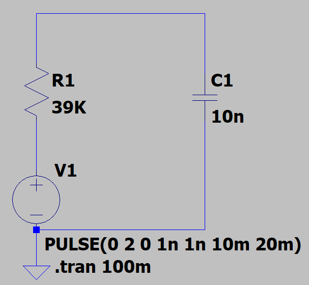
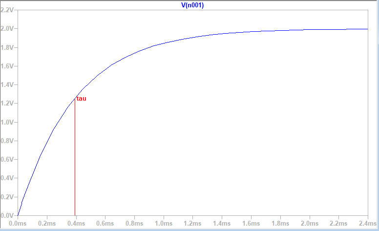
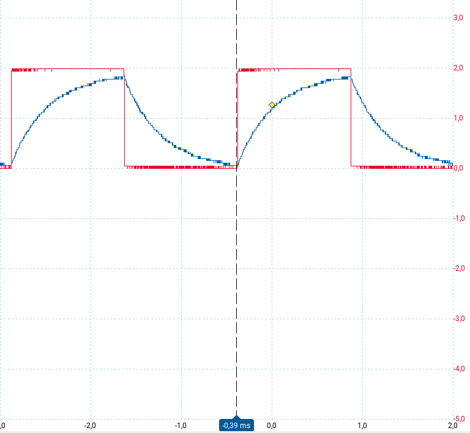
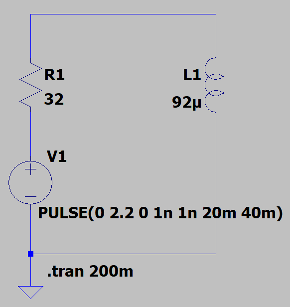
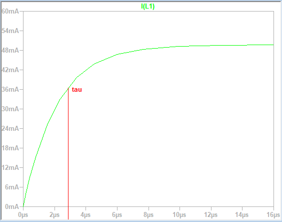

# Lab 03 - Step Response of RC and RL Circuits
*Group members: Felix Collin & Daniel Kortesmaa* 

## Part 1: RC Circuit

### Instructions
 
 1. Construct a series RC circuit in LTSpice. Use the following personalized component parameters:

	 - R = (the last two digits of your student number + 10) kΩ. (For example, if the last two digits are 47, then R = 57 kΩ) 
	 - C = (the third and fourth digits of your student number + 1) nF. 
	
 2. Interface a step source to transition from 0 V to (the first two digits of your student number divided by 10) V at 1 ms. 
 3. Execute the simulation and plot the voltage across the capacitor over time. 
 4. Extract the half-time from the step response and validate it against the theoretical value τ=RC. 

### Schematics

 - V1 = 2 V
 - R1 = 39 k&Omega;
 - C1 = 10 nF

 ### Theoretical values
$$
\tau = RC = 39 000 \Omega; \cdot 10 \cdot 10^{-9} F = 0.39 ms
$$

 ### Simulation

&tau; = 0.39 ms (measuring voltage)

### Measurements

The measured value of tau was 0.39 ms.

Explanation of colors:
- Red = VC1
- Blue = Vin

## Part 2: RL Circuit

### Instructions

1.  Set up a series RL circuit in LTSpice using the parameters:
    
    -   R = (the fifth and sixth digits of your student number + 20) Ω.
        
    -   L = (the seventh and eighth digits of your student number + 2) µH.
        
2.  Integrate a step source to induce a transition similar to the RC circuit.
3.  Run the simulation and record the current through the inductor over time.
4.  Determine the half-time from the step response and compare it with the theoretical expression τ=L/R​.
5.  Additionally, document the voltage across the inductor over time.

### Schematics

 - V1 = 2.2 V
 - R1 = 32 &Omega;
 - L1 = 92 µF

### Theoretical values

$$
\tau = \frac{L}{R} = \frac{92 \cdot 10^{-6} H}{32 \Omega} = 2.875 \mu s
$$

### Simulation

&tau; = 2.875 &mu;s (measuring current)

## Used equipment in laboratory measurements

- PicoScope 2000 Series Oscilloscope (used both as a measuring device and a signal generator)
- Zhongyi ZY-206H Powered Breadboard (used only as a non-powered breadboard)