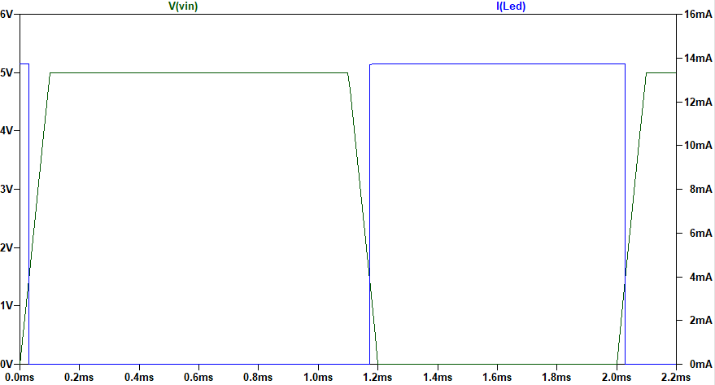
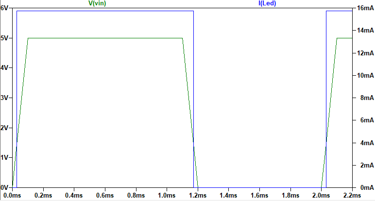

# Lab 04 - Transistor as a Switch

Group members: Felix Collin & Daniel Kortesmaa

Date of the report: 14 December 2023

## 1 Introduction

The objective of this laboratory exercise is to learn how to use NPN and PNP transistors as a switch. We should simulate, build, and measure four different circuits:

1. a circuit where an NPN transistor is used as a switch
2. a circuit where a PNP transistor is used as a switch
3. a circuit where an NPN transistor and inverter is used to control a LED
4. a circuit where a PNP transistor and inverter is used to control a LED

The simulations should be done with LTSpice, whereas the actual measurements should be conducted with a digital oscilloscope. The details of each circuit are discussed in the following.

## 2 NPN transistor as a switch

### 2.1 Instructions

We have been given a task to simulate and build the circuit shown below. The idea is to demonstrate how an NPN transistor can be used to control the flow of current in a circuit.

According to the instructions, the adjustable voltage source can be done using a potentiometer and a fixed voltage source. In LTSpice, we should use a pulse generator with slow rise/fall times to create a linear ramp from 0 to x volts.

Our objective is to

1. run transient analysis in LTSpice and plot the voltages and currents as a function of time
2. measure the input and output voltage of the circuit with an oscillospe
3. draw a diagram Vout(Vin)
4. draw a diagram IC(IB), where IC is the collector current and IB is the base current
5. mark to both diagrams the cutoff, active, and saturation regions of the transistor

### 2.2 Simulation

#### 2.2.1 Schematic

Note: V2 is a pulse generator giving one pulse starting from 0 V and ending to 5 V.

#### 2.2.2 Measurements and diagrams

Voltages are plotted as a function of time in the following diagram:

As the diagram above shows, VC starts to drop when Vin reaches ~0.65 V. At the same time, current starts to flow from the collector to the emitter as shown in the following diagram:

The saturation region starts when Vin reaches ~2.00 V.

### 2.3 Built circuit

#### 2.3.1 Schematic

#### 2.3.2 Measurements and diagrams

Vin and Vout were measured with an oscilloscope as shown in the image below. The red line refers to Vin and the blue line to Vout.

As the image above shows, the transistor becomes active when Vin reaches ~0.65 V, which matches with our simulation. The saturation region starts when Vin reaches ~1.5 V, which is about 0.5 V less than in the simulation. This is most likely caused by the fact that we did not define a model for our transistor when running the simulation.

The Vout(Vin) diagram is shown below.

In order to draw a diagram IC(IB), we must calculate the currents when the transistor becomes active and when it saturates. In the case of IB, the currents are

$$
I_{B_{cut}} = \frac{V_{in}-V_{BE}}{R_2} = \frac{0.65V-0.65V}{10k\Omega} = 0 A
$$

$$
I_{B_{sat}} = \frac{V_{in}-V_{BE}}{R_2} = \frac{1.47V-0.65V}{10k\Omega} ≈ 82 \mu A
$$

Similarly, we can calculate IC:

$$
I_{C_{cut}} = \frac{V_{1} - V_{C}}{R_1} = \frac{11.6 V - 11.6 V}{1k\Omega} = 0 A
$$

$$
I_{C_{sat}} = \frac{V_{1} - V_{C}}{R_1} = \frac{11.6 V - 0 V}{1k\Omega} = 11.6 mA
$$

The IC(IB) diagram is shown below.

## 3 PNP transistor as a switch

### 3.1 Instructions

Our task is to build a similar circuit as in the previous section, but we should use a PNP transistor instead of an NPN transistor. Since voltages and currents are vice versa, we should use -12 V for both VCC and Vin.

Like in the previous section, our objective is to

1. run transient analysis in LTSpice and plot the voltages and currents as a function of time,
2. measure the input and output voltage of the circuit with an oscillospe,
3. draw a diagram Vout(Vin),
4. draw a diagram IC(IB), where IC is the collector current and IB is the base current, and
5. mark to both diagrams the cutoff, active, and saturation regions of the transistor.

### 3.2 Simulation

#### 3.2.1 Schematic

Note: V2 is a pulse generator giving one pulse starting from 0 V and ending to -12 V.

#### 3.2.2 Measurements and diagrams

Voltages are plotted as a function of time in the following diagram:

As the diagram shows, VC starts to drop when Vin reaches ~ -0.65 V. At the same time, current starts to flow as shown in the diagram below:

The saturation region starts when V~in~ reaches ~ -2.00 V.

### 3.3 Built circuit

#### 3.3.1 Schematic

#### 3.3.2 Measurements and diagrams

Vin and Vout were measured with an oscilloscope as shown in the image below. The red line refers to Vin and the blue line to Vout.

As the image above shows, the transistor becomes active when Vin reaches ~ -0.75 V, which is about -0.1 V more than in our simulation. The saturation region starts when Vin reaches ~ -1.5 V, which is about -0.5 V less than in the simulation. These differences are most likely caused by the fact that we did not define a model for our transistor when running the simulation.

The Vout(Vin) diagram is shown below.

We can calculate IB when the transistor becomes active and when the transistor saturates:

$$
I_{B_{cut}} = \frac{V_{in}-V_{BE}}{R_2} = \frac{-0.75V-(-0.75V)}{10k\Omega} = 0 A
$$

$$
I_{B_{sat}} = \frac{V_{in}-V_{BE}}{R_2} = \frac{-1.5V-(-0.75V)}{10k\Omega} ≈ -75 \mu A
$$

Similarly, we can calculate IC:

$$
I_{C_{cut}} = \frac{V_{1} - V_{C}}{R_1} = \frac{-12 V - (-12 V)}{1k\Omega} = 0 A
$$

$$
I_{C_{sat}} = \frac{V_{1} - V_{C}}{R_1} = \frac{-12 V - (-0 V)}{1k\Omega} = -12 mA 
$$

The IC(IB) diagram is shown below.

## 4 Controlling a LED with an NPN transistor and inverter

### 4.1 Instructions

Our task to design, simulate and build a circuit with a NPN bipolar transistor which is able to feed 15 mA to a LED. 
 
The transistor should be controlled by a logic inverter (74HC04 or 74LS04, or any logic gate providing logic '0's and '1's). The maximum current taken from the inverter should be 1 mA.
 
We should use 12V VCC for the transistor. The logic circuit should be built by using 5 V, meaning that the logical '1' is 5 V.
 
Our objective is to verify the functionality of the circuit and measure the current through the LED. 

### 4.2 Resistor values

We must first calculate the values of the resistors that will be used in the circuit. Supposing that the voltage drop caused by the LED is 0.7 V, the values should be:

$$
R_1 = \frac{V_1 - 0.7 V}{I_{C_{sat}}} = \frac{12.0V - 0.7V}{0.015 A} ≈ 753 \Omega
$$

$$
R_2 = \frac{V_2 - 0.7 V}{I_{B}} = \frac{5.0V - 0.7V}{0.001 A} = 4.3 k\Omega
$$

When we use E12 series resistors, the closest matches are R1 = 820 &Omega; and R2 = 4.7 k&Omega;.

### 4.3 Simulation

#### 4.3.1 Schematic

Note: Vin is a pulse generator giving one pulse starting from 0 V and ending to 5 V.

#### 4.3.2 Measurements and diagrams

When Vin = 0 V:
- IB ≈ 0.9 mA
- ILED ≈ 13.8 mA

When Vin = 5 V:
- IB = 0 mA
- ILED = 0 mA

The LED's behaviour is following an inverted logic as shown in the diagram below.

### 4.4 Built circuit

#### 4.4.1 Schematic

#### 4.4.2 Measurements

The oscilloscope measurements are presented in the image below. The blue line refers to VLED, whereas the redline is Vin.

As the image above shows, VLED starts to increase when Vin goes below ~2.5 V, and it reaches its maximum voltage when Vin is at ~1.96 V. The behaviour of the LED is therefore following an inverted logic as it should.

In the simulation, the voltage drop caused by the LED was 0.7 V. In the built circuit, however, the voltage drop was 2.6 V. Thus, the voltage across R1 is as follows:

$$
V_{R_{1}} = V_{1} - V_{LED} = 12 V - 2.6 V = 9.4 V
$$

With this result, ILED would be as follows:

$$
I_{LED} = I_{R_{1}} = \frac{V_{R_{1}}}{R_1} = \frac{9.4 V}{820 \Omega} ≈ 11.5 mA
$$

The desired LED current is 15 mA, but this was not reached with the built circuit as the voltage drop caused by the LED is 2.6 V instead of 0.7 V. The value of R1 should therefore be as follows:

$$
R_{1} = \frac{V_{R_{1}}}{I_{LED}} = \frac{9.4 V}{0.015 A} ≈ 627 \Omega
$$

The closest match in the E12 series would be 680 &Omega;.

## 5 Controlling a LED with a PNP transistor and inverter

### 5.1 Instructions

We should design, simulate and build a circuit with a PNP bipolar transistor which is able to feed 15 mA to a LED. VCC should be 5 V.

The transistor should be controlled by a logic inverter (74HC04 or 74LS04, or any logic gate providing logic '0's and '1's). The maximum current going into the inverter should be 1 mA. We should use 5 V logic circuits, that is, the logical '1' is 5 V.   

Our objective is to verify the functionality of the circuit and measure the current through the LED.

### 5.2 Resistor values

We must first calculate the values of the resistors that will be used in the circuit. Supposing that the voltage drop caused by the LED is 0.7 V, the values should be:

$$
R_1 = \frac{V_1 - 0.7 V}{I_{C_{sat}}} = \frac{5.0V - 0.7V}{0.015 A} ≈ 287 \Omega
$$

$$
R_2 = \frac{V_2 - 0.7 V}{I_{B}} = \frac{5.0V - 0.7V}{0.001 A} = 4.3 k\Omega
$$

When we use E12 series resistors, the closest matches are R1 = 270 &Omega; and R2 = 4.7 k&Omega;.

### 5.3 Simulation

#### 5.3.1 Schematic

Note: Vin is a pulse generator giving one pulse starting from 0 V and ending to 5 V.

#### 5.3.2 Measurements and diagrams

When Vin = 0 V:
- IB ≈ 0.9 mA
- ILED ≈ 15.5 mA

When Vin = 5 V:
- IB = 0 mA
- ILED = 0 mA

The LED's behaviour is following an inverted logic as shown in the diagram below. Because we are using a PNP transistor, the inverted logic means in this case that the LED is on when Vin is at 5 V.

### 5.4 Built circuit

#### 5.4.1 Schematic

#### 5.4.2 Measurements

The oscilloscope measurements are presented in the image below. The blue line refers to VLED, whereas the redline is Vin.

In the simulation, the voltage drop caused by the LED was 0.7 V. In the built circuit, however, the voltage drop was 3.0 V. (Note that the voltage drop is bigger than it was in the previous task. This might be caused by the fact that the tasks were conducted during different laboratory sessions, meaning that the LEDs that we used were not exactly the same component.)

Thus, the voltage across R1 is as follows:

$$
V_{R_{1}} = V_{1} - V_{LED} = 5.0 V - 3.0 V = 2.0 V
$$

With this result, ILED would be as follows:

$$
I_{LED} = I_{R_{1}} = \frac{V_{R_{1}}}{R_1} = \frac{2.0 V}{270 \Omega} ≈ 7.4 mA
$$

The desired LED current is 15 mA, but this was not reached with the built circuit as the voltage drop caused by the LED is 3.0 V instead of 0.7 V. The value of R1 should therefore be as follows:

$$
R_{1} = \frac{V_{R_{1}}}{I_{LED}} = \frac{2.0 V}{0.015 A} ≈ 133 \Omega
$$

The closest match in the E12 series would be 150 &Omega;.

## 6 Used equipment in laboratory measurements

- Zhongyi ZY-206H Powered Breadboard
- PicoScope 2000 Series Oscilloscope
- Fluke 11 Multimeter (used in resistance measurements)