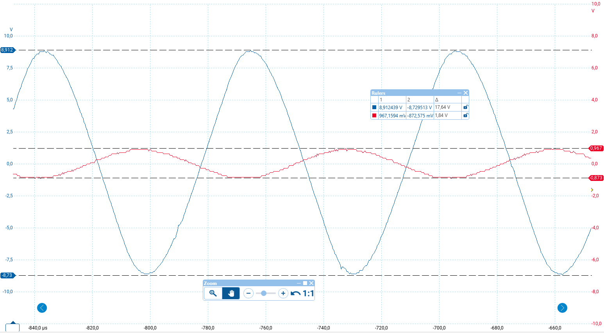

# Lab 05 - Operational amplifier - part 1

*Group members: Felix Collin & Daniel Kortesmaa* 

## Task 1: Slew rate of a voltage follower

### Instructions

Measure the slew rate of LM741 operational amplifier, when it is operating as a voltage follower. 

Note: You can adjust the input signal to be a square wave to make the measurement easier. Remember to provide the supply voltages for the Operational Amplifier (typically +15V and -15V). 
 
Tip: There is a slight "jump" in the beginning, when output starts to rise, but use the linear part of the output curve to determine the slope (which equals slew rate, V/us).   

Provide oscilloscope pictures, use the markers, show input and output in a same plot, in other words, use 2 channels of the oscilloscope. (Because it helps you to understand input/output relationship.) 

### Schematics

Note: V1 is a square ware generator providing input voltage of &pm; 1 V. 

### Simulation

$$
S = \frac{\Delta V}{\Delta t} = \frac{0.81563257 V}{2.509825 \mu s} ≈ 0.32 \frac{V}{\mu s}
$$

### Lab measurements

$$
S = \frac{\Delta V}{\Delta t} = \frac{1.132 V}{1.402 \mu s} ≈ 0.81 \frac{V}{\mu s}
$$

The result do not match with the simulation (0.32 V/&mu;s vs 0.81 V/&mu;s). The difference may be related to the component used in the simulation as we don't know how well it has been configured. The observed phenomenon is nevertheless the same.

## Task 2: Non-inverting amplifier

### Instructions

Design a noninverting amplifier, which voltage gain is 10. 

a) Adjust the input voltage to be 1Vsin(&omega;t) and check that the output voltage is 10Vsin(&omega;t). (For part c, this is considered Voutmax) After this increase the amplitude of the input voltage and check when the output voltage is cut (=saturated from "top" or from "bottom"). 

b) Increase the frequency of your input voltage and check with an oscilloscope when the output voltage starts to decrease. 

c) Measure the bandwidth of your amplifier (Hint: The cut off frequency is the frequency where the output voltage has declined to value 0,71*Voutmax , that is, the initial output voltage, used in part a) 

Provide oscilloscope pictures, use the markers, show input and output in a same plot, in other words, use 2 channels of the oscilloscope. (Because it helps you to understand input/output relationship.) 

### Calculations

We know that AV = 1 + (R2 / R1).

We know that

$$
A_V = 1 + \frac{R_f}{R_g}
$$

We choose Ri to be 4.7 k&Omega;.

The value of Rf can be determined by solving the following equation:

$$
A_V = 1 + \frac{R_f}{R_g}
$$

$$
10 = 1 + \frac{R_f}{4.7k\Omega}
$$

$$
9 = \frac{R_f}{4.7k\Omega}
$$

$$
R_f = 9 * 4.7k\Omega = 42.3 k\Omega
$$

Thus, Rf must be constructed from two resistors connected in series with values of 39 k&Omega; + 3.3 k&Omega; = 42.3 k&Omega;.

### Schematics

Note: V1 is a sine wave generator providing input signal of &pm; 1 V.

### Simulation

#### Point a: determine that gain is 10

#### Point b: increase frequency

As the figure above shows, the output voltage has decreased by ~ 0.045 V when the frequency is set to 10 kHz.

#### Point c: measure bandwidth

The cut off frequency is marked in the diagram with a cross, and it is around 102 kHz. The bandwidth of the amplifier is therefore 1 Hz - 102 kHz.

### Lab measurements

#### Point a

The measured values of resistors:
- R1 = 4.98 k&Omega;
- R2 = 38.85 k&Omega;
- R3 = 3.27 k&Omega;

$$
A_V = \frac{\Delta V_{out}}{\Delta V_{in}} = \frac{17.75V}{1.884 V} ≈ 9.4
$$

The result is within expectations as the resistance values are not exactly as specified.

#### Point b

The voltage drop starts appear when frequency is at 11 kHz. It becomes more visible soon after.

#### Point c

The theoretical bandwidth should be frequency at this voltage

$$
0.71 \cdot V_{out_{max}} = 0.71 \cdot 9.05V ≈ 6.4V
$$

which matches with our measurements.

The bandwidth is 0-22.5 kHz. Please note that this does not match with the simulation. After discussions with the teacher, it appeared to be that the LM741 component used in the LTSpice is not working as intended; the measured value from the built circuit is therefore more likely correct.

## Task 3: Inverting amplifier

### Instructions

Design an inverting amplifier, which voltage gain is -10. 

a) Adjust the input voltage to be 1Vsin(&omega;t) and check that the output voltage is -10Vsin(&omega;t). 

b) Increase the frequency of your input voltage and check with an oscilloscope when the output voltage starts to decrease. 

c) Measure the bandwidth of your amplifier (Hint: The cut off frequency is the frequency where the output voltage has declined to value 0,71*Voutmax.)  

Provide oscilloscope pictures, use the markers, show input and output in a same plot, in other words, use 2 channels of the oscilloscope. (Because it helps you to understand input/output relationship.)

### Calculations

We know that

$$
|A_{cl(I)}| = \frac{R_f}{R_i}
$$

We choose Ri to be 4.7 k&Omega;.

The value of Rf can be calculated:

$$
R_f = |A_{cl(I)}| \cdot R_i = |-10| \cdot 4.7 k\Omega = 47 k\Omega
$$

### Schematics

Note: V1 is a sine wave generator providing input signal of &pm; 1 V.

### Simulation

#### Point a: determine that gain is -10

Explanation of colors:
- V(n003) = V1
- V(vout) = Vout

#### Point b: increase frequency

As the figure above shows, the output voltage has decreased by ~ 0.055 V when the frequency is set to 10 kHz. (Note: this does not match with the results that were achieved with non-inverting amplifier in task 2.)

#### Point c: measure bandwidth

The cut off frequency is marked in the diagram with a cross, and it is around 92.5 kHz. The bandwidth of the amplifier is therefore 1 Hz - 92.5 kHz.

### Lab measurements

#### Point a

The measured values of resistors:
- R1 = 4.7 k&Omega;
- R2 = 47.2 k&Omega;

$$
A_V = - \frac{\Delta V_{out}}{\Delta V_{in}} = -\frac{17.64V}{1.738 V} ≈ -10.15
$$

The result is very close to our expectations.

#### Point b

The voltage drop starts appear when frequency is at 14 kHz. It becomes more visible soon after.

#### Point c

The theoretical bandwidth should be frequency at this voltage

$$
0.71 \cdot V_{out_{max}} = 0.71 \cdot 8.82V ≈ 6.3V
$$

which matches with our measurements.

The bandwidth is 0-25 kHz. Please note that this does not match with the simulation. After discussions with the teacher, it appeared to be that the LM741 component used in the LTSpice is not working as intended; the measured value from the built circuit is therefore more likely correct.

## Task 4: Summing amplifier

### Instructions

Design a summing amplifier, which output voltage is 𝑉𝑜=−1,8∙𝑉in1−2,5∙𝑉in2 
(in other words: The circuit shall amplify Vin1 by 1.8 and Vin2 by 2.5 - and both of those are inverted) 

(hint: The other input voltage should be DC and the other AC, that is, sinusoidal. This way the components are easier to detect on output voltage by looking at the DC level and AC amplitude of the component). 

a) Calculate the component values 

b) Simulate with LTspice 

c) Implement the circuit and measure it 

### Calculations

We shall choose Rf to be 4.7 k&Omega;.

The formula of Vout in summing amplifier is : 
$$
Vout = -(\frac{R_f}{R_1} \cdot {V_1}+ \frac{R_f}{R_2} \cdot {V_2} + ... + \frac{R_f}{R_n} \cdot {V_n})
$$
In our summing amplifier, we have two inputs hence we also only have R1 and R2.

In order to get multipliers -1.8 for V1 and -2.5 for V2 we calculate the following

$$
{R_1} =  \frac{R_f}{1.8} = \frac{4700\Omega}{1.8} = 2611.11... \Omega ≈ 2611\Omega
$$

Using same formula for R2

$$
{R_2} = \frac{R_f}{2.5} = \frac{4700\Omega}{2.5}
= 1880\Omega
$$

We have decided to use Vin1 as 1V DC, and Vin2 as 2V AC @50Hz. Based on these input voltages, we should be seeing an output that has a DC component of -1.8V and an AC component of -5V. V2pp = 10V, ranging from 3.2V to -6.8V (+-5V from -1.8V). 

$$
{V_1out} = -(1.8 \cdot {V_1}) = -(1.8 \cdot 1V) = -1.8V
$$
$$
{V_2out} = -(2.5 \cdot {V_2}) = -(2.5\cdot 2sin(2 \pi \cdot 50 \cdot t))V
$$
$$
{V_2pp} = 2 \cdot |-(2.5\cdot2V)| = 2\cdot |-5V| = 10V
$$
Vout is the sum of V1out and V2out components.

### Schematics

### Simulation

### Lab measurements

The measured values of resistors:
- R1 = 2.4 k&Omega;
- R2 = 1.72 k&Omega;
- Rf = 4.7 k&Omega;

The amplification is slightly less than in the simulation because the values of R1 and R2 were slightly lower than they should have been, and the signal generator has internal impendance, which affects the results. The problem could have been solved by using resistors with higher values.

## Task 5: summing amplifier

### Instructions

Design a summing amplifier, which output voltage is 𝑉𝑜=3∙𝑉s1+4∙𝑉s2 

(hint: Use DC +AC, same as in step 4. Pay attention to math. Refer to schematics of non-inverting summing amplifier above) 

a) Calculate the component values 

b) Simulate with LTspice 

c) Implement the circuit and measure it 

### Calculations

In order to achieve gains of 3 for Vin1 and 4 for Vin2, we shall pick nearest resistors from E12 series with similiar ratio between the two values. These will be achieved through putting 1k&Omega; resistors in series until we reach the desired resistances. For R1 it would be 3k&Omega; and 4k&Omega; for R2. Ideally the ratio for V1 would be as follows:

$$
\frac{3}{7} = \frac{R_2}{R_1+R_2}
$$

and for V2 it would be as follows:

$$
\frac{4}{7} = \frac{R_1}{R_1+R_2}
$$

These values would then be multiplied by common gain with 7 in order to reach the desired gains of 3 and 4 respectively. However due to component limitations we would reach following values for R1 and R2 using series connection:

$$
{R_1} = {R_{1_1}}+{R_{1_2}}+{R_{1_3}}+{R_{1_4}}
$$
$$
 {R_{1_1}}={R_{1_2}}={R_{1_3}}={R_{1_4}}=1k\Omega
$$

$$
{R_1} = 4k\Omega
$$

$$
{R_2} = {R_{2_1}}+{R_{2_2}}+{R_{2_3}}
$$
$$
 {R_{1_1}}={R_{1_2}}={R_{1_3}}=1k\Omega
$$

$$
{R_2} = 3k\Omega
$$

$$
 \frac{R_2}{R_1+R_2}=\frac{1k\Omega+1k\Omega+1k\Omega}{1k\Omega+1k\Omega+1k\Omega+1k\Omega+1k\Omega+1k\Omega+1k\Omega} = \frac{3k\Omega}{7k\Omega}=\frac{3}{7}
$$

$$
 \frac{R_1}{R_1+R_2}=\frac{1k\Omega+1k\Omega+1k\Omega+1k\Omega}{1k\Omega+1k\Omega+1k\Omega+1k\Omega+1k\Omega+1k\Omega+1k\Omega} = \frac{4k\Omega}{7k\Omega}=\frac{4}{7}
$$

And for global gain we choose our feedback resistor to be 6k&Omega; and the grounding resistor 1k, creating a global gain of 7.

$$
\frac{R_f+R_g}{R_g} = \frac{6k\Omega+1k\Omega}{1k\Omega}=7
$$

Due to component limitation, this feedback resistor would be achieved as follows :
$$
{R_f}= {R_{f1}}+{R_{f2}}+{R_{f3}}+{R_{f4}}+{R_{f5}}+{R_{f6}}
$$

$$
{R_{f1}}={R_{f2}}={R_{f3}}={R_{f4}}={R_{f5}}={R_{f6}} = 1k\Omega
$$

$$
{R_f}= 6k\Omega
$$

The grounding resistor Rg can be achieved with a single component :
$$
{R_g} = 1k\Omega
$$

For the purpose of demonstrating the simulation of the circuit, we have chosen V1 to be 1V DC and V2 to be 1V AC.

### Schematics
To be noted, in the schematic we are using components as R1, R2, Rf and Rg respectively as is for clarity. When building the circuit, these components are supposed to be built as mentioned above, in series connections of multiple 1k&Omega; resistors.

### Simulation

### Lab measurements

Due to time and component constraints, we used the following resistors with their measured values:

- Rg = 1k&Omega;
- Rf = 5.58 k&Omega; + 390 &Omega; = 5.97 k&Omega;
- R1 = 3.9 k&Omega; + 100 &Omega; = 4 k&Omega;
- R2 = 2.7 k&Omega; + 270 &Omega; = 2.97 k&Omega;

The measured output values differ slightly from the simulation, which is most likely caused by the fact that our voltage sources could not provide exactly those voltages that were required. The values of R1 and R2 are also a bit small as the signal generator has internal impedance that affects the results.

## Task 6: summing amplifier for Arduino

### Instructions

Use an operational amplifier LM741 to adjust a signal described in figure below so, that Arduino is able to read it ( = signal has to be between 0 - 5 V).

a) Provide the schematics with component values 

b) Simulate with LTspice 

c) Implement the circuit and measure it 

### Calculations

Since the input signal is &pm;2 V and the signal does not have to be exactly 0-5 V, we can simply add a DC component with a value of 2.5 V to get a signal that Arduino can read. We can use a summing amplifier for this by summing the AC and DC signal together. No additional gain for any of these signals is needed, meaning that the values of R3 and R4 must be the same. Similarly, the values of R1 and R2 must be the same in order to split the common gain evenly to both signals. It is however important to use resistors with high enough values in order to avoid problems caused by the signal generator's internal impendance. In this respect, 10k&Omega; works well for R1 and R2.

### Schematics

### Simulation

### Lab measurements

The result matches quite well with our simulation.

## Used equipment in laboratory measurements

- Zhongyi ZY-206H Powered Breadboard
- PicoScope 2000 Series Oscilloscope
- Fluke 11 multimeter (for resistance measurements)