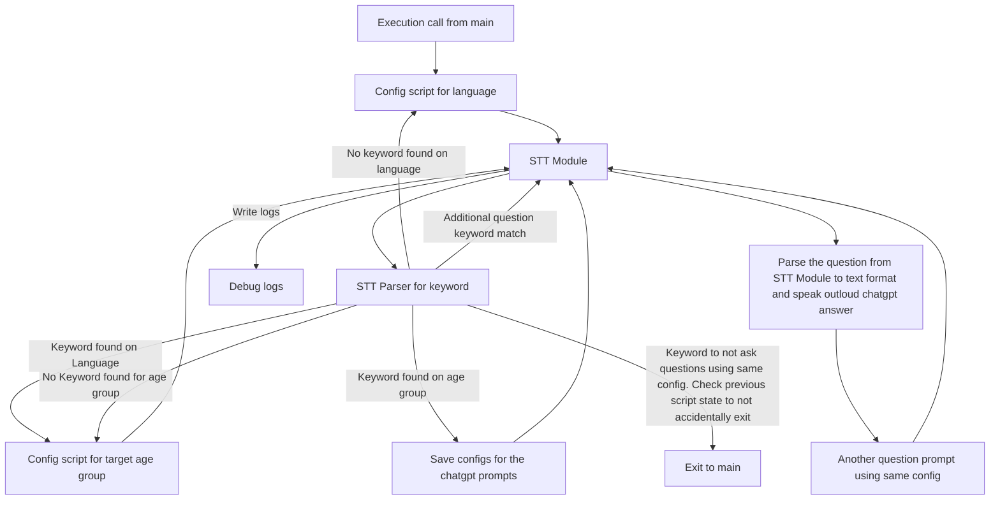
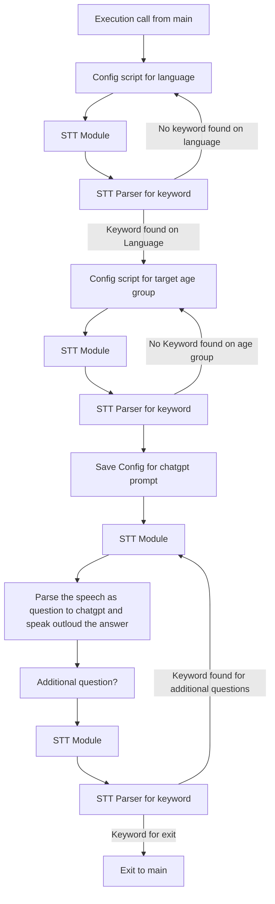

## ask_chatgpt()

Additional feature on every step:

Timeout on every function call, if met break current & call exit to main

Potentially create this as FSM.

## Feedback variant for visual clarity
