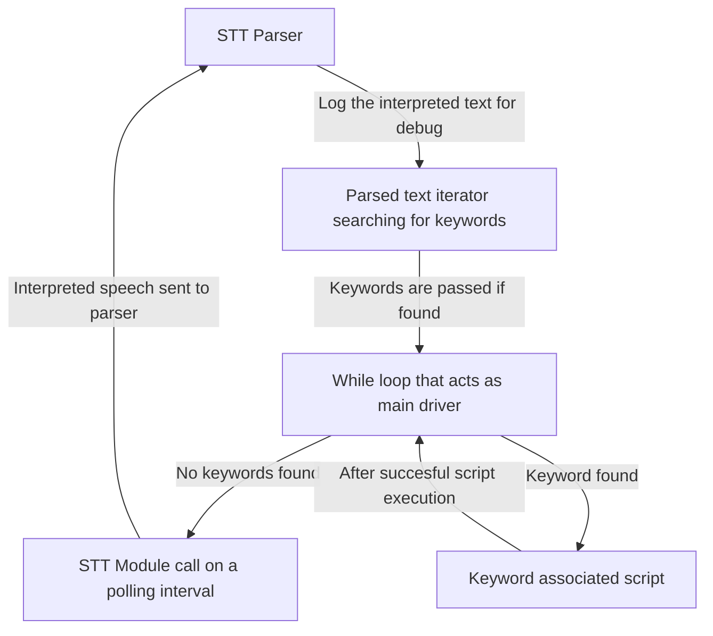

## Main()

```mermaid
graph TD

A[STT Parser] -->|Log the interpreted text for debug |D[Parsed text iterator searching for keywords]
B[While loop that acts as main driver] --> |No keywords found| C[STT Module call on a polling interval]
C -->|Interpreted speech sent to parser| A
D--> |Keywords are passed if found|B
B-->|Keyword found|E[Keyword associated script]
E-->|After succesful script execution|B
```