## Task 1 from powerpoint (preliminary)

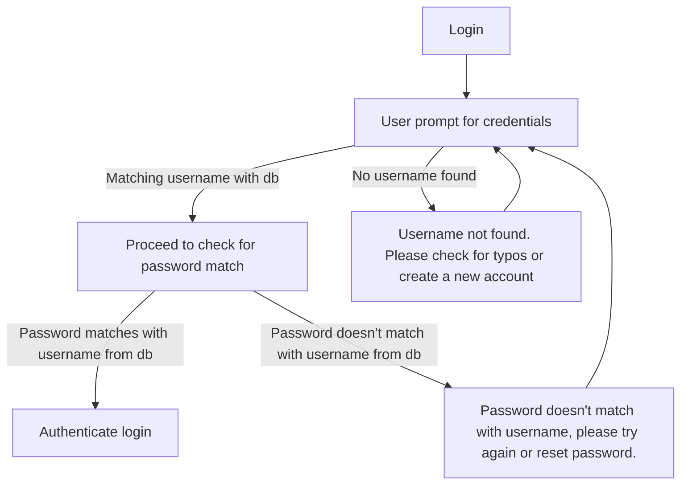

## Task 2 from powerpoint (preliminary)

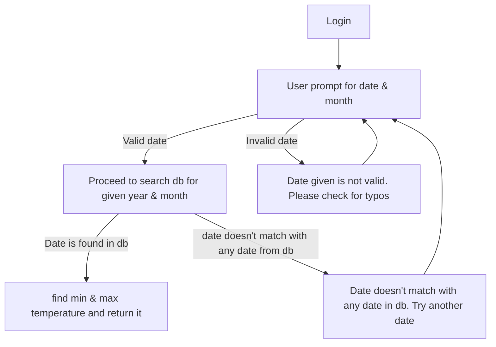

## TRAK Exercises 1

### 1. 
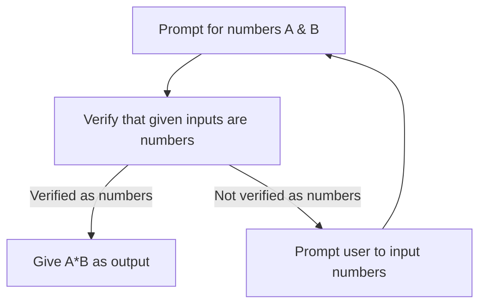

### 2. 

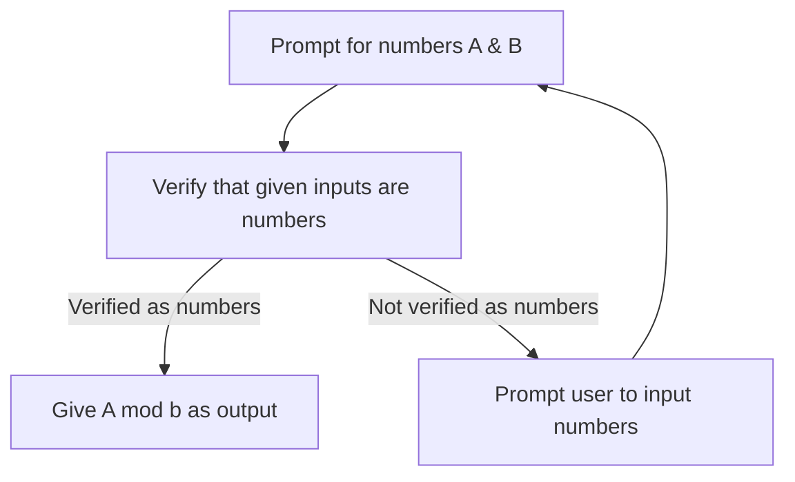

### 3. 

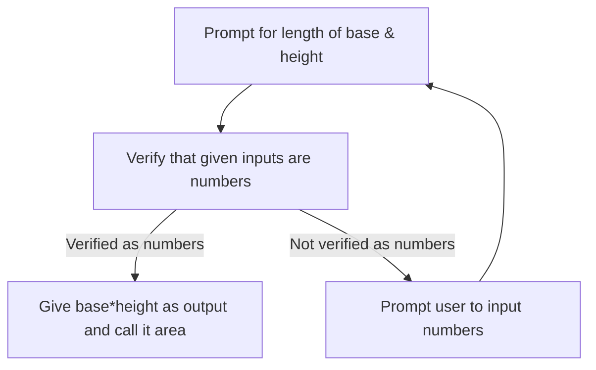

### 4. 

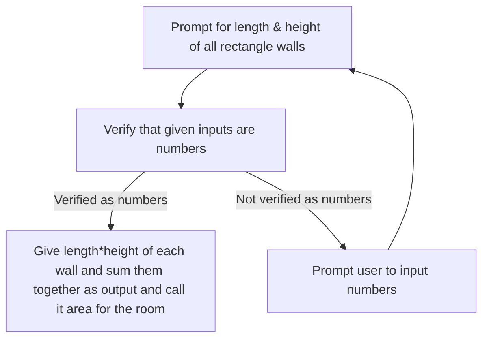

### 5. 

### 6.  
Side note, Herons formula 
$$
A = \sqrt{s\cdot (s-a)\cdot(s-b)\cdot(s-c)}
$$
$$
s = \frac{a+b+c}{2}
$$

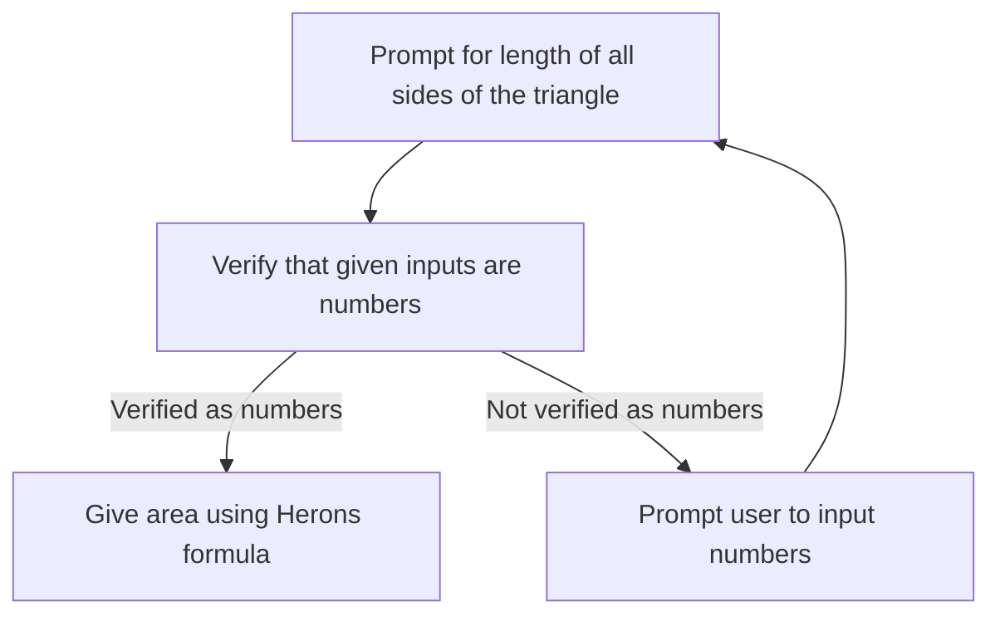

### 7. 
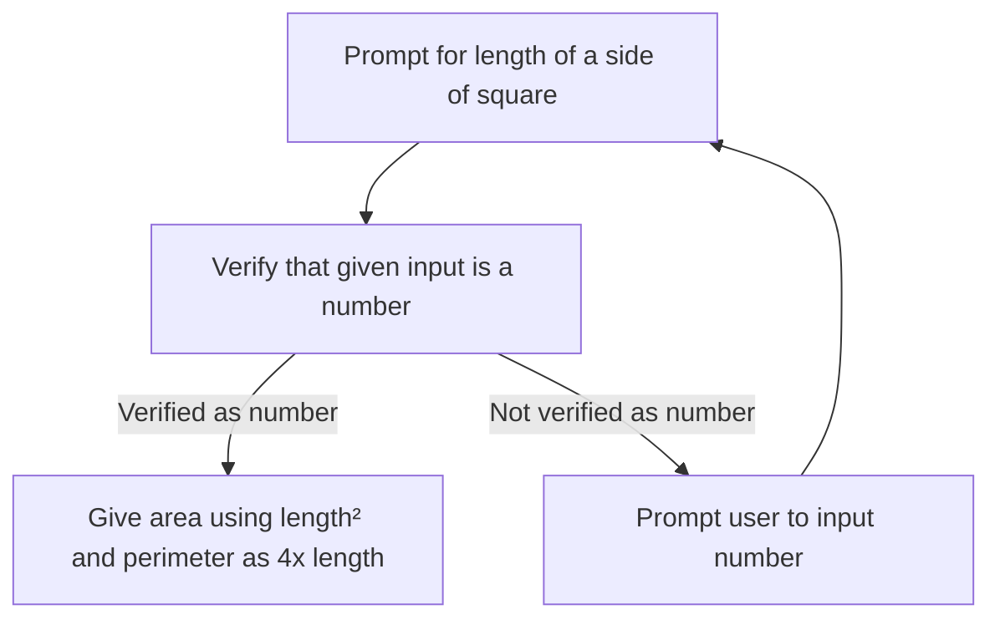

### 8. 

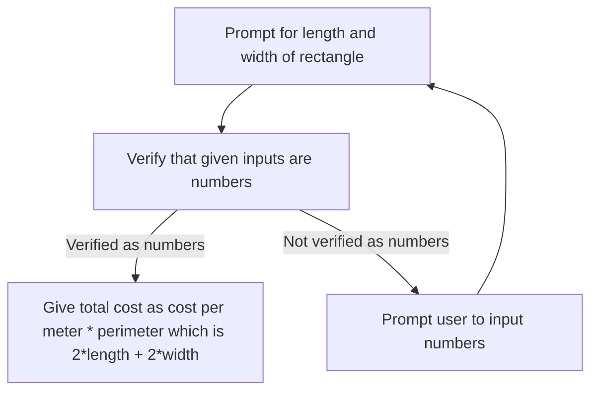

### 9. 
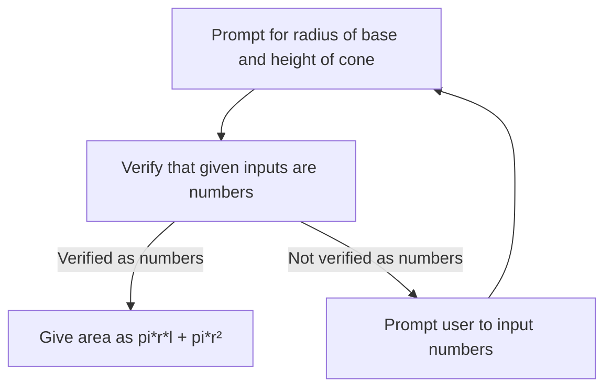

### 10. 
Note due to mermaid being bad with brackets inside a box, ill type the math for volume seperately here for clarity
$$
V = \frac{4}{3}\pi r³
$$

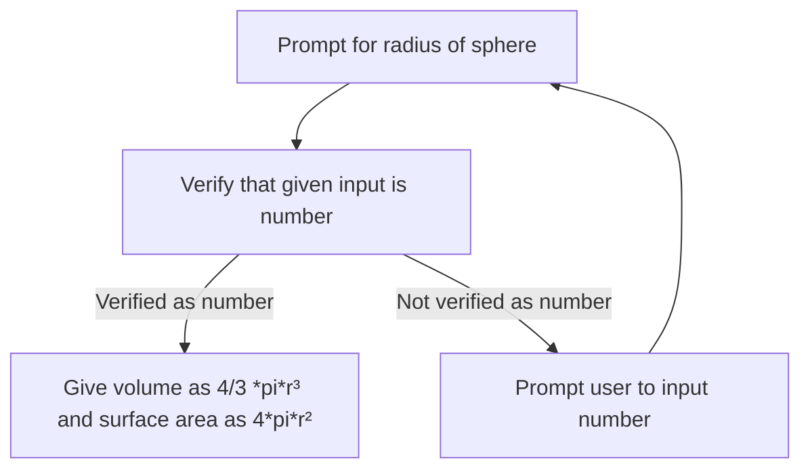

### 11. 

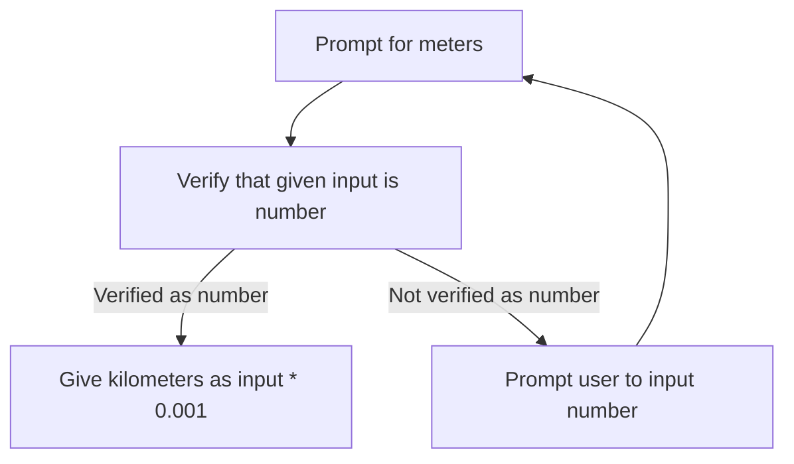

### 12. 
Note to self, ask if we use any or all interpretations?

Interpretation 1:

Math for the graph

$$
P_{12bananas} = x
$$
$$
P_{1banana} = \frac{x}{12}
$$
where x is arbitrary number that is representing the cost of 12 bananas and P_1bananas is representing the price of 1 banana.

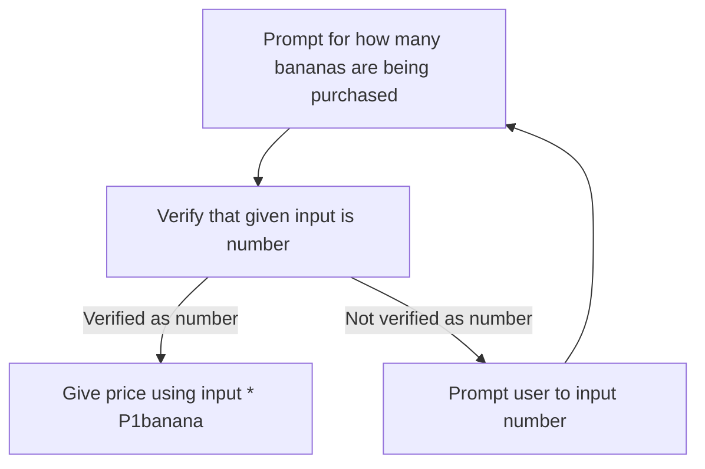

### 15. 
Conversion formula

$$
\frac{C}{5}=\frac{F-32}{9}
$$

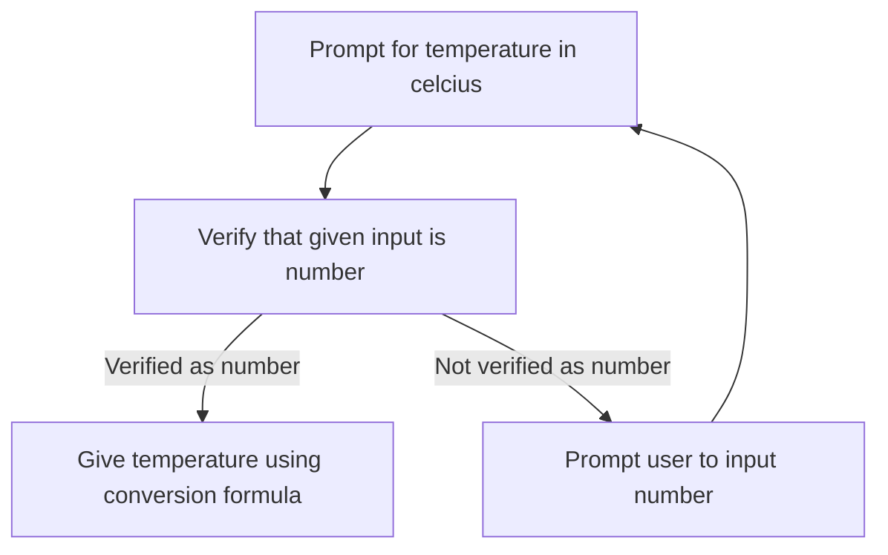