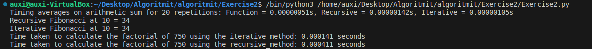

### Code used
```python
import timeit

def factorial_recursive(n):
    if n == 0:
        return 1
    else:
        return n * factorial_recursive(n-1)

def factorial_iterative(n):
    factorial = 1
    for i in range(1, n + 1):
        factorial *= i
    return factorial

def measure_time(function, number_of_iterations, repetitions): #For above factorials
    total_time = 0
    for _ in range(repetitions):
        start_time = timeit.default_timer()
        function(number_of_iterations)
        end_time = timeit.default_timer()
        elapsed_time = end_time - start_time
        total_time += elapsed_time

    average_time = total_time / repetitions
    return average_time

def fibonacci_ite(n):
    if n < 1:
        print("Invalid input. Please enter a positive integer.")
    elif n ==2:
        return 1
    elif n == 1:
        return 0
    else:
        fibonacci_numbers = []

        fibonacci_numbers.append(0)
        fibonacci_numbers.append(1)

        for i in range(2, n):
            current_f_number = fibonacci_numbers[i - 1] + fibonacci_numbers[i - 2]
            fibonacci_numbers.append(current_f_number)
        
        return fibonacci_numbers[n - 1]
    
def fibonacci_rec(n):
    if n <= 0:
        return "Invalid input. Please enter a positive integer."
    elif n == 1:
        return 0
    elif n == 2:
        return 1
    else:
        return fibonacci_rec(n - 1) + fibonacci_rec(n - 2)

def arithmetic_sequence_term(a1, d, n):
    return a1 + (n-1) * d

def arithmetic_sequence_sum(a1, d, n):
    return (n / 2) * (2 * a1 + (n - 1) * d)

def recursive_arithmetic_sum(a1, d, n):
    if n == 1:
        return a1
    else:
        return a1 + recursive_arithmetic_sum(a1 + d, d, n-1)
    
def iterative_arithmetic_sum(a1, d, n):
    sum = 0
    current_term = a1

    for _ in range(n):
        sum += current_term
        current_term += d
    return sum

def measure_time_arithmetic(function, a1, d, n, repetitions): #For above arithmetic sums
    total_time = 0
    for _ in range(repetitions):
        start_time = timeit.default_timer()
        function(a1, d, n)
        end_time = timeit.default_timer()
        elapsed_time = end_time - start_time
        total_time += elapsed_time

    average_time = total_time / repetitions
    return average_time

first_term = 5
difference = 2
terms = 7
repetitions = 20 #Amount of repetitions for calculating average time to run the functions

time_func = measure_time_arithmetic(arithmetic_sequence_sum,first_term, difference, terms, repetitions)
time_rec = measure_time_arithmetic(recursive_arithmetic_sum,first_term, difference, terms, repetitions)
time_ite = measure_time_arithmetic(iterative_arithmetic_sum,first_term, difference, terms, repetitions)

print(f"Timing averages on arithmetic sum for {repetitions} repetitions: Function = {time_func:.08f}s, Recursive = {time_rec:.08f}s, Iterative = {time_ite:.08f}s")

count = 10

fibo_rec = fibonacci_rec(count)
print(f"Recursive Fibonacci at {count} = {fibo_rec}")

fibo_ite = fibonacci_ite(count)
print(f"Iterative Fibonacci at {count} = {fibo_ite}")

factorial_number = 750

iterative_time = measure_time(factorial_iterative, factorial_number, repetitions)
print(f"Time taken to calculate the factorial of {factorial_number} using the iterative method: {iterative_time:.6f} seconds")
5
recursive_time = measure_time(factorial_recursive, factorial_number, repetitions)
print(f"Time taken to calculate the factorial of {factorial_number} using the recursive method: {recursive_time:.6f} seconds")

```


### Picture of terminal output

