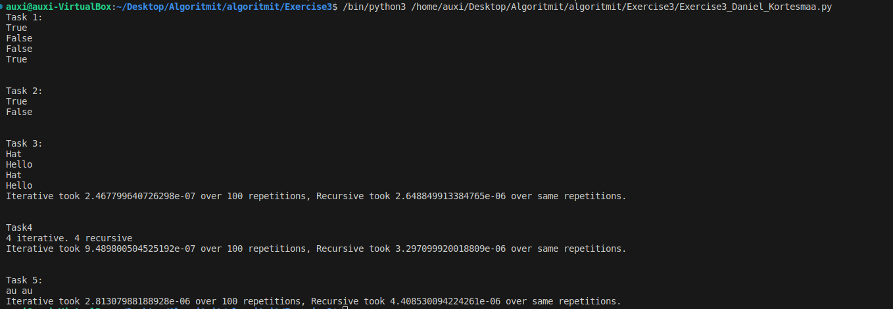

## Code

#### Libraries
```python
import timeit
```

#### Task1
```python

def isPal(phrase):
    return phrase.lower() == phrase[::-1].lower() 
#Converting string to lowercase. Technically speaking not neccesary, its only to make a string such as example4 return as true. If not desired, remove the .lower()

#Time Complexity: O(n), Space Complexity: O(1) on above function

print("Task 1:")
# Examples, comment out to prevent terminal being full of true falses if neccesary
print(isPal("OM-MO"))   # True
print(isPal("Hello"))    # False
print(isPal("A man, a plan, a canal, Panama"))  # False
print(isPal("Able was I saw eLba")) # True
```

#### Task2
```python
def check(a,b):
    return sorted(a) == sorted(b)

A = [1,2,3,3,4,5,5,5,6]

B = [6,3,2,5,3,1,5,4,5]


C = [1,2,3]

D = [1,2,2]

task2_1 =check(A, B)
task2_2 =check(C,D)
print("Task 2:")
print(f"{task2_1} \n{task2_2}") #Comment out for terminal clarity

```

#### Task3
```python
def copy(a:str, b:str): #Iterative
    A = a
    B = b
    stored_string = B #To store original
    B = A
    return f"{A}"

def copyr(a, b): #Recursive
        length = len(a)
        def helper(a,b,length):
            stored_string = b #To store original
            if len(a) == 0 or len(b) == length:
                return b
            b += a[0]
            return helper(a[1:], b,length)
        return helper(a,"", length)

def measure_time(function,a,b,repetitions): #For above copy functions
    total_time = 0
    for _ in range(repetitions):
        start_time = timeit.default_timer()
        function(a,b)
        end_time = timeit.default_timer()
        elapsed_time = end_time - start_time
        total_time += elapsed_time

    average_time = total_time / repetitions
    return average_time
    
ad = "Hat"
bd = "Trick"
cd = "Hello"
dd = "World"

task3_ite1 =copy(ad, bd)
task3_ite2 =copy(cd,dd)

task3_rec1 = copyr(ad, bd)
task3_rec2 = copyr(cd, dd)
print("Task 3:")
print(f"{task3_ite1} \n{task3_ite2}")
print(f"{task3_rec1} \n{task3_rec2}")
repetitions = 100
time_ite3 = measure_time(copy,ad, bd, repetitions)
time_rec3 = measure_time(copyr,ad, bd, repetitions)
print(f"Iterative took {time_ite3} over {repetitions} repetitions, Recursive took {time_rec3} over same repetitions.")
#Comment out for clarity on terminal
```

#### Task4
```python
#Sort list, take uniques only (removes duplicates). If we want Kth element instead, just use sorted(lst) instead of sorted(set(lst))
def find_kth_smallest(lst, k): #Iterative
    unique_sorted_list = sorted(set(lst)) 
    if 1 <= k <= len(unique_sorted_list):
        return unique_sorted_list[k - 1]
    else:
        return None 

#Recursive approach, same functionality as iterative.
def find_kth_smallest_recursive(lst, k):
    unique = sorted(set(lst))
    if not unique or k <= 0 or k > len(unique):
        return None

    min_element = min(unique)
    unique.remove(min_element)

    if k == 1:
        return min_element
    else:
        return find_kth_smallest_recursive(unique, k - 1)


A = [3,6,4,7,2,4,6,8,3,3,3]
kth_element = 3
inspected_element_ite = find_kth_smallest(A,kth_element)
inspected_element_rec = find_kth_smallest_recursive(A,kth_element)
print("Task4")
print(f"{inspected_element_ite} iterative. {inspected_element_rec} recursive")

time_ite2 = measure_time(find_kth_smallest,A, kth_element, repetitions)
time_rec2 = measure_time(find_kth_smallest_recursive,A, kth_element, repetitions)
print(f"Iterative took {time_ite2} over {repetitions} repetitions, Recursive took {time_rec2} over same repetitions.")
#Comment out for clarity on terminal
```

#### Task5
```python
def measure_time_lcp(function,a,repetitions): #For below lcp functions
    total_time = 0
    for _ in range(repetitions):
        start_time = timeit.default_timer()
        function(a)
        end_time = timeit.default_timer()
        elapsed_time = end_time - start_time
        total_time += elapsed_time

    average_time = total_time / repetitions
    return average_time

def lcp(strings): #Recursive approach using helper function inside
    #Exit out
    if not strings:
        return ""

    # Helper function. Iterates through strings (the function input), and appends to prefix if everything matches. The loop breaks when first non-match is found.
    def recursive_helper(str_list):
        if len(str_list) == 1:
            return str_list[0]

        prefix = ""
        min_len = min(len(s) for s in str_list)
        
        
        for i in range(min_len):
            if all(s[i] == str_list[0][i] for s in str_list[1:]):
                prefix += str_list[0][i]
            else:
                break
        
        return prefix
    #Recursive call
    return recursive_helper(strings)

def longest_common_prefix(strings): #Iterative approach
    if not strings:
        return ""

    # Take the first string as a reference
    reference_str = strings[0]

    # Find the common prefix with the reference string
    common_prefix = ""
    for i in range(len(reference_str)):
        for string in strings[1:]:
            if i >= len(string) or reference_str[i] != string[i]:
                return common_prefix
        common_prefix += reference_str[i]

    return common_prefix

# Example usage:
strings_list = ["autokauppa", "autonkuljettaja", "auttaja", "aurinko"]
result_ite = longest_common_prefix(strings_list)
result_rec = lcp(strings_list)
print("Task 5:")
print(result_ite, result_rec)


time_ite = measure_time_lcp(longest_common_prefix,strings_list,repetitions)
time_rec = measure_time_lcp(lcp,strings_list,repetitions)
print(f"Iterative took {time_ite} over {repetitions} repetitions, Recursive took {time_rec} over same repetitions.")
```

## Terminal output 
### Consists all tasks

