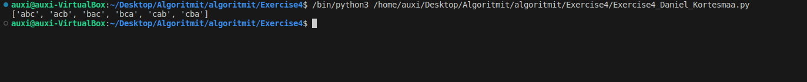

### E1. 

a)  
```Python 
    import numpy as np #Python library
    row = x
    col = y
    matrix = np.empty((row, col), dtype=int) #matrix contains integers
    print(matrix[0,0])
```

b)
    matrix[0, :] *= 2

c)
    matrix[:, :] *= 2

For a time complexity is O(1), as we are printing a static location that doesn't include any iterating so the complexity doesn't increase.

For b & c time complexity is O(rows, col), as we have to iterate over all elements regardless of if we multiply rows or columns or both.

### E2.

Linear complexity, Exponential complexity, Quadratic  complexity & Logarithmic complexity.

Linear growth on 2 & 6, logarithmic on 4 & 5, quadratic on 1 & 5. Exponential on 3.

Linear complexity due to the presence of a variable which causes linear growth based on variable size.

Logarithmic complexity due to presence of logarithmic function which causes logarithmic growth based on variable size.

Quadratic complexity due to presence of n^2 in function which causes quadratic growth based on variable size.

Exponential complexity due to presence of 2^n in function which causes exponential growth based on variable size.

### E3.

a)V: 100 s
$$
T(1000) = 1
$$

$$
T(1000) = 1000²\cdot k
$$

$$
k = \frac{1}{1000^2}
$$

$$
T(10000) = \frac{1}{1000^2} \cdot 10000^2 = 100s
$$

b) V: 4/3 s

$$ T(1000) = 1$$
$$ k \cdot {log_2}(1000) = 1 $$
$$ k = \frac {1}{{log_2}(1000)} $$
$$ T(10000) = \frac {1}{{log_2}(1000)} \cdot {log_2}(10000) $$
$$ T(10000) = \frac {4}{3} s$$


### E4. Approximate values used. NOT CERTAIN IF THESE ARE CORRECT.

|          | 10       | 1000     | 10 000   | 100 000  |
|----------|----------|----------|----------|----------|
| log<sub>2</sub>(n) |3.32us | 9.97us | 13.29us | 16.61us |
|√n | 3.16us | 31.6us | 100us | 316us |
| n | 10us | 1ms | 10ms | 100ms |
| n²| 100us| 10ms| 1s| 10s|
| n!|3628.8 s| 1000! * 1us | 10 000! *1us | 100 000! * 1us |


### E5.

50 -> log<sub>2</sub>(n)  ->  n^0.5 -> 100n -> n²log<sub>10</sub>(n) -> 2^n 

### E6.

a) Task2

b) Task1

Task2 is more complex due to Task1 only requiring iterating over the list once, whereas Task2 needs to iterate over through the entire list anyway (to figure out its length) and after that jump to the middle of the list.

### E7. 

``` Python
def permutations(s):
    if len(s) == 0:
        return ['']
    
    perms = []
    for i in range(len(s)):
        first_char = s[i]
        remaining_chars = s[:i] + s[i+1:]
        for perm in permutations(remaining_chars):
            perms.append(first_char + perm)
    
    return perms
```


Recursive functiom that makes calls until it reaches len(s) in for loop, and then in another nested for loop we go through the remaining chars recursively until theres none left, which means that the number of calls is n!(=complexity).
