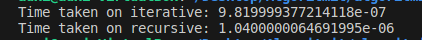

### Task 1: Introduction to Search Algorithms

1. Linear search iterates over the entire array of elements that are being searched, whereas binary search utilizes divide and conquer, where problem is first split into smaller pieces and then collected together after these smaller bits are solved.

2. 
#### Linear

```python
def search(arr, x):
    for i in arr:
        if i == x:
            return arr.index(i)
    return -1 #Element not found, handle outside func
```

```python
def search(arr,x):
    zero = 0
    end = len(arr) - 1
    #Can initialize mid, but not neccesary in python
    while zero <= high:
        mid = (zero + end) // 2 #Floor division
        if arr[mid] < x:
            zero = mid + 1
        elif arr[mid] > x:
            end = mid -1
        else:
            return mid
    return -1 #Element not found, handle outside func

```

3. Linear search will always take as many iterations as there are array elements in worst case. 

In binary search, we split the array from the middle, and then check if the array element that we are interested in is greater or smaller than the middle point. This only works if the array is ordered, since if the array is not ordered, we wouldn't accurately know if the element is supposed be located in the half that is smaller or greater than the middlemost array element. However if the array is ordered, then the efficiency is two base logarithmic due to being able to split the searched array in half every time using floor division.

4. 

```python
def search(arr, x, zero=0, end=len(arr)):
    if end >= zero:
        mid = (end+zero) // 2

        if arr[mid] == x:
            return mid
        
        elif arr[mid] > x:
            return search(arr, x, zero, mid-1)

        else:
            return search(arr, x, mid+1, end)
    
    else:
        return -1 #Element not found, handle outside func
```



Code in full inside .py file

### Task 2: Dive into Sorting Algorithms - Part 1

1. Bubbling sort repeatedly swaps the array elements that are next to eachother if they aren't in order and then proceeds to next element and repeats the process.

Insertion sort iterates from left to right, selecting the next element to be inserted into the sorted portion of the array.

2. 
#### Bubble sort
```python
def bubble_sort(arr):
    n = len(arr)
    counter = 0
    for i in range(n):
        for j in range(0, n-i-1):
            if arr[j] > arr[j+1]:
                arr[j], arr[j+1] = arr[j+1], arr[j]
                counter += 1
                print("Current array at stage", counter, ":", arr)
    return arr
```
#### Insertion sort

```python
def insert_sort(arr):
    for i in range(1, len(arr)):
        x = arr[i]

        j = i - 1
        while j >= 0 and x < arr[j]:
            arr[j+1] = arr[j]
            j -= 1
        arr[j+1] = x
        print("Current array at stage", i, ":", arr)
    return arr
```


Array to be sorted : arr = [2, 7, 3, 102, 476, 47, 6, 25]

4.  In best case case scenario, if the array is already sorted, bubble sort doesn't require any steps, and it will just print the sorted array as is, so the time complexity is O(1).

However for insertion sort, it will still perform n-1 amount of comparisons before returning the sorted array, so its time complexity in best case scenario is O(n).

In worst case, both solutions are quadratic in nature. For both, this happens when the array is in reverse order. The key difference is that insertion will still take n-1 steps to perform the sorting of the array, but the comparisons and swaps that the function performs are still as follows:

$$
n\cdot\frac{n-1}{2}
$$

Bubble sort however, has the following amount of comparisons and swaps in worst case :

$$
(n-1)\cdot(n-1)= (n-1)²
$$


A key note regarding average case is that bubble sort often requires multiple passes through the array even if its mostly sorted.

Insertion sort therefore tends to performs better than bubble sort. So unless the goal is to create simple code, in which case bubble sort is appropriate, insertion sort is preferred.


### Task 3: Dive into Sorting Algorithms - Part 3

1. Divide and conquer splits the array into parts, sorts them, and then merges the divided splits back together.

In quicksort, we choose a pivot element in the array. Then the array is partitioned to elements greater than pivot which are placed to the pivots right, and elements lesser than the pivot which are placed to its left. 

Then two pointers are initialized at the beginning and end of the array. Then these pointers are moved towards the pivot, until there are an element inbetween beginning and pivot that is bigger or equal to the pivot, and element inbetween end and pivot that is smaller or equal to the pivot, and then these two elements swap places. This process is repeated until the two pointers cross eachother.

After that, the pivot is placed in its correct position, which is often done by swapping pivots point with the element that is the pointer that started from the end of the array.

Then the pivot index is returned so that we can recursively apply partitioning logic to the sub-arrays.

2. 

```python
#Merge sort
def merge_sort(arr):
    if len(arr) > 1:
        mid = len(arr) // 2
        start = arr[:mid]
        end = arr[mid:]
        merge_sort(start)
        merge_sort(end)
        i = j = k = 0

        while i < len(start) and j < len(end):
            if start[i] < end[j]:
                arr[k] = start[i]
                i += 1
            else:
                arr[k] = end[j]
                j += 1
            k += 1
        
        while i < len(start):
            arr[k] = start[i]
            i += 1
            k += 1
        
        while j < len(end):
            arr[k] = end[j]
            j += 1
            k +=1
    return arr

```

```python
#Quick sort
def partition(arr, low, high):
    pivot_index = (low + high) // 2  # Choose the middle element as pivot
    pivot = arr[pivot_index]
    i = low - 1
    j = high + 1

    while True:
        i += 1
        while arr[i] < pivot:
            i += 1
        
        j -= 1
        while arr[j] > pivot:
            j -= 1

        if i >= j:
            return j

        arr[i], arr[j] = arr[j], arr[i]

def quicksort(arr, low, high):
    if low < high:
        # Partitioning index, arr[p] is now at right place
        pi = partition(arr, low, high)

        # Separately sort elements before partition and after partition
        quicksort(arr, low, pi)
        quicksort(arr, pi + 1, high)
```


3. Merge sort maintains O(n log(n)) complexity through best to worst case. This is because regardless of if the array is sorted or not, it will divide the array into halves recursively until there is only one element in each subarray, and then they get merged together.

Quick sort is often O(n log(n)) in time complexity. It often divides the array into roughly equal partitions on each recursion step. 

However, in the absolute worst case, when the pivot is selected to be either smallest or largest element in the array, causing everything to be in one side of the partition while the other is empty. This can happen if the array is either sorted or almost sorted, but there are techniques to mitigate that (median-of-three, random pivot to name a few). The time complexity in that case is O(n²).

Merge sort can require up to O(n) in space complexity, due to requiring space for the subarrays which can be as large as the original array. This space requirement increases at each recursion level, but it isn't tied to the size of the original array but instead on the amount of elements that are being merged at any given recursion level.

4. 

I'll add the partition function only as that is whats relevant.

```python
#First element
def partition(arr, low, high):
    pivot = arr[low]
    i = low - 1
    j = high + 1

    while True:
        i += 1
        while arr[i] < pivot:
            i += 1
        
        j -= 1
        while arr[j] > pivot:
            j -= 1

        if i >= j:
            return j

        arr[i], arr[j] = arr[j], arr[i]
```

```python
#Last element
def partition(arr, low, high):
    pivot = arr[high]
    i = low - 1
    j = high + 1

    while True:
        i += 1
        while arr[i] < pivot:
            i += 1
        
        j -= 1
        while arr[j] > pivot:
            j -= 1

        if i >= j:
            return j

        arr[i], arr[j] = arr[j], arr[i]
```

```python
#Median of Three
def median_of_three(arr, low, high):
    mid = (low + high) // 2
    if arr[low] > arr[mid]:
        arr[low], arr[mid] = arr[mid], arr[low]
    if arr[low] > arr[high]:
        arr[low], arr[high] = arr[high], arr[low]
    if arr[mid] > arr[high]:
        arr[mid], arr[high] = arr[high], arr[mid]
    return mid

def partition(arr, low, high):
    pivot_index = median_of_three(arr, low, high)
    pivot = arr[pivot_index]
    arr[high], arr[pivot_index] = arr[pivot_index], arr[high]  # Move pivot to the end
    i = low - 1
    
    for j in range(low, high):
        if arr[j] <= pivot:
            i += 1
            arr[i], arr[j] = arr[j], arr[i]
    
    arr[i + 1], arr[high] = arr[high], arr[i + 1]
    return i + 1

```


As said before, in most cases quick sort works in time complexity of n log(n), regardless of which pivot you choose. However, if the array is already sorted or nearly sorted, then the partitioning is uneven and thus the time complexity becomes n². This is even moreso true if you choose a pivot from either end of the array. However, this can be mitigated, and there are more than just one way of achieving this. 

As discussed before, one way is to pick a random index in the array, and partitioning around that. Another technique which is demonstrated here, is using median of three. Basically, we take the middlemost array element, the beginning and end element, and swap them around based on their value from smallest to biggest. Then after these three are ordered, we return the index of the middlemost element.

### Task 4: Advanced Sorting Algorithms and Complexities

1. Shell sort performs insertion sort on a given array, starting from largest gap and then gradually decreasing the gap size. After sorting with final gap size, there is a final insertion sort pass. This can be achieved by having the gap size be 1.

Heapsort consists of two main steps, heaping and sorting. It picks a minimum value or maximum value in the array (depending on if the goal is to make descending or ascending array), and places it at the end of the array. Then the size of the heap is reduced by one, and a new heap is then searched from the array. This process is then repeated until the array is sorted.


2. 

``` python
def shell_sort(arr):
    n = len(arr)
    gap = n // 2
    while gap > 0:
        for i in range(gap, n):
            temp = arr[i]
            j = i
            while j >= gap and arr[j-gap] > temp:
                arr[j] = arr[j-gap]
                j -= gap
            arr[j] = temp
        gap //= 2
    return arr

```

```python
def heapify(arr, n, i):
    largest = i  # Initialize largest as root. Left and right children are considered as a pair from root. Root is i(n), left is i(n+1) and right is i(n+2)
    left = 2 * i + 1
    right = 2 * i + 2

    # Check if left child exists and is greater than root
    if left < n and arr[left] > arr[largest]:
        largest = left

    # Check if right child exists and is greater than largest so far
    if right < n and arr[right] > arr[largest]:
        largest = right

    # Change root, if needed
    if largest != i:
        arr[i], arr[largest] = arr[largest], arr[i]  # Swap
        # Heapify the affected sub-tree
        heapify(arr, n, largest)

def heapsort(arr):
    n = len(arr)

    # Build a max heap. n//2 -1 is last non-leaf node, -1 is heap root.
    for i in range(n // 2 - 1, -1):
        heapify(arr, n, i)

    # Extract elements one by one. To change from asc to desc, change step to +1. (Third element in range()). 
    for i in range(n - 1, 0, -1):
        arr[i], arr[0] = arr[0], arr[i]  # Swap
        heapify(arr, i, 0)

```

3. Shell sorts time complexity is entirely dependant on the gap sequence that is used. The absolute worst case for shell sort is O(n²), however generally speaking shell sort does perform better than other sorting algorithms with same time complexity (e.g. insertion sort).

When talking about heapsort, the time complexity in every case is O(n log(n)). This is because it builds a heap from input array and then repeatedly extracts either the minimum or maximum element from the heap. This efficiency is also not tied to the initial order of the array. Another benefit of heapsort is that it doesn't require additional space that is proportional to the input array.

4. If we observe the code for heap sort in 4.2, we can see that the array that we wish to sort is being passed to both heapify and heapsort functions as argument, and at no given point is memory reserved for anything except the variables that are used for length of the array, indexes in the array (root, left and right child) and the array itself.


### TASK 5: Search and Sort Algorithm Applications

1. 
```python

import csv


def heapify_csv(arr, n, i, key):
    largest = i  # Initialize largest as root
    left = 2 * i + 1
    right = 2 * i + 2

    # Check if left child exists and is greater than root
    if left < n and int(arr[left][key]) > int(arr[largest][key]):
        largest = left

    # Check if right child exists and is greater than largest so far
    if right < n and int(arr[right][key]) > int(arr[largest][key]):
        largest = right

    # Change root, if needed
    if largest != i:
        arr[i], arr[largest] = arr[largest], arr[i]  # Swap
        # Heapify the affected sub-tree
        heapify_csv(arr, n, largest, key)


def heapsort_csv(arr, key):
    n = len(arr)

    # Build a max heap. n//2 - 1 is last non-leaf node, -1 is heap root, step is -1.
    for i in range(n // 2 - 1, -1, -1):
        heapify_csv(arr, n, i, key)

    # Extract elements one by one
    for i in range(n - 1, 0, -1):
        arr[i], arr[0] = arr[0], arr[i]  # Swap
        heapify_csv(arr, i, 0, key)


def get_median_min_max_salaries(csv_file):
    with open(csv_file, 'r', newline='') as file:
        reader = csv.DictReader(file)
        salaries = [int(row['salary_in_usd']) for row in reader]

    # Calculate median
    n = len(salaries)
    if n % 2 == 0:
        median = salaries[n // 2 - 1] #Arbitrary decision
    else:
        median = salaries[n // 2]

    # Minimum salary is the first element
    min_salary = salaries[0]

    # Maximum salary is the last element
    max_salary = salaries[-1]

    return median, min_salary, max_salary


# Read CSV file and sort it using heapsort
csv_file = '/home/auxi/Desktop/Algoritmit/algoritmit/Exercise6/jobs_in_data.csv'
sorted_csv_file = '/home/auxi/Desktop/Algoritmit/algoritmit/Exercise6/sorted_csv_file.csv'

# Open input and output CSV files
with open(csv_file, 'r', newline='') as infile, open(sorted_csv_file, 'w', newline='') as outfile:
    reader = csv.DictReader(infile)
    fieldnames = reader.fieldnames
    writer = csv.DictWriter(outfile, fieldnames=fieldnames)
    writer.writeheader()

    # Process CSV rows in chunks
    key = 'salary_in_usd'
    chunk_size = 1000  # Adjust as needed
    while True:
        rows = [row for _, row in zip(range(chunk_size), reader)]
        if not rows:
            break

        heapsort_csv(rows, key)

        for row in rows:
            writer.writerow(row)


```


2. Due to the size of the dataset, I chose to use heap sort. Since I chose to order the csv based on salary in usd, and there was no clear pattern already present, hence I chose an efficient sorting algorithm.

3. It is important to choose a sorting algorithm based on the needs. If you work in small datasets, it is preferrable to work with simple to understand sorting algorithms which allow you to build easily on top of it without having to spend time in learning the intricacies involved in the more complex sorting algorithms. However, as size of the data that one works with increases, and / or the associated use is extremely timing crucial, the need for simplicity has to be replaced with appropriate sturdiness of the method and efficiency. This efficiency can also vary depending on requirements, as for example in embedded environment, the only restraint isn't neccesarily only time but also space. Then it becomes increasingly important to also take into account the potential space restraints that are often present in embedded devices.

Also, it is good to take note of the structure of the data. If the data is mostly in order, but for example any new instance that gets appended to the dataset is not ordered, it is then not wise to use methods like bubble sort, which isn't efficient in sorting if the dataset is mostly in order. Perhaps using something like insertion sort would be more preferable in that case. However, if the datasets that require sorting are not in any particular order, and sorting needs to be done often, something like heapsort might be a strong contender.

It is however important to implement multiple sorting algorithms, and test their performance against the kinds of datasets one works with. It helps one build understanding of what works well in a given situation and lets one make better educated guesses on what to use in production later. However
having basic understanding of each algorithms strengths and weaknesses lets one limit the amount of testing neccesary, as if we take the above example of using a sorted array where any new entry is just appended to it, even if you do wish to implement a sorting algorithm, it might not be worthwhile to look into bubble sort for aforementioned reasons.


4. I chose to compare insert + quick sort hybrid against heap sort. Code and output comparison (of a single run) below.

Code:
```python
import csv
import time

def heapify_csv(arr, n, i, key):
    largest = i  # Initialize largest as root
    left = 2 * i + 1
    right = 2 * i + 2

    # Check if left child exists and is greater than root
    if left < n and int(arr[left][key]) > int(arr[largest][key]):
        largest = left

    # Check if right child exists and is greater than largest so far
    if right < n and int(arr[right][key]) > int(arr[largest][key]):
        largest = right

    # Change root, if needed
    if largest != i:
        arr[i], arr[largest] = arr[largest], arr[i]  # Swap
        # Heapify the affected sub-tree
        heapify_csv(arr, n, largest, key)


def heapsort_csv(arr, key):
    n = len(arr)

    # Build a max heap. n//2 - 1 is last non-leaf node, -1 is heap root, step is -1.
    for i in range(n // 2 - 1, -1, -1):
        heapify_csv(arr, n, i, key)

    # Extract elements one by one
    for i in range(n - 1, 0, -1):
        arr[i], arr[0] = arr[0], arr[i]  # Swap
        heapify_csv(arr, i, 0, key)

def insertion_sort(arr, key):
    for i in range(1, len(arr)):
        key_item = arr[i]
        j = i - 1
        while j >= 0 and int(arr[j][key]) > int(key_item[key]):
            arr[j + 1] = arr[j]
            j -= 1
        arr[j + 1] = key_item


def quicksort(arr, key, low, high):
    if low < high:
        # Partition the array
        pi = partition(arr, key, low, high)

        # Recursively sort elements before and after partition
        quicksort(arr, key, low, pi - 1)
        quicksort(arr, key, pi + 1, high)


def partition(arr, key, low, high):
    pivot = int(arr[high][key])
    i = low - 1
    for j in range(low, high):
        if int(arr[j][key]) < pivot:
            i += 1
            arr[i], arr[j] = arr[j], arr[i]
    arr[i + 1], arr[high] = arr[high], arr[i + 1]
    return i + 1


def hybrid_sort(arr, key, threshold=10):
    if len(arr) < threshold:
        insertion_sort(arr, key)
    else:
        quicksort(arr, key, 0, len(arr) - 1)


def get_median_min_max_salaries(csv_file):
    with open(csv_file, 'r', newline='') as file:
        reader = csv.DictReader(file)
        salaries = [int(row['salary_in_usd']) for row in reader]

    # Calculate median
    n = len(salaries)
    if n % 2 == 0:
        median = salaries[n // 2 - 1] #Arbitrary decision
    else:
        median = salaries[n // 2]

    # Minimum salary is the first element
    min_salary = salaries[0]

    # Maximum salary is the last element
    max_salary = salaries[-1]

    return median, min_salary, max_salary


# Read CSV file and sort it using heapsort & hybrid
csv_file = '/home/auxi/Desktop/Algoritmit/algoritmit/Exercise6/jobs_in_data.csv'
sorted_csv_file = '/home/auxi/Desktop/Algoritmit/algoritmit/Exercise6/sorted_csv_file.csv'
hybrid_csv_file = '/home/auxi/Desktop/Algoritmit/algoritmit/Exercise6/hybrid_csv_file.csv'

# Open input and output CSV files for heap
with open(csv_file, 'r', newline='') as infile, open(sorted_csv_file, 'w', newline='') as outfile:
    reader = csv.DictReader(infile)
    fieldnames = reader.fieldnames
    writer = csv.DictWriter(outfile, fieldnames=fieldnames)
    writer.writeheader()

    # Process CSV rows in chunks
    key = 'salary_in_usd'
    chunk_size = 1000  # Adjust as needed
    while True:
        rows = [row for _, row in zip(range(chunk_size), reader)]
        if not rows:
            break
        
        heap_start_time = time.time()
        heapsort_csv(rows, key)
        heap_end_time = time.time()

        for row in rows:
            writer.writerow(row)

# Open input and output CSV files for hybrid
with open(csv_file, 'r', newline='') as infile, open(hybrid_csv_file, 'w', newline='') as outfile:
    reader = csv.DictReader(infile)
    fieldnames = reader.fieldnames
    writer = csv.DictWriter(outfile, fieldnames=fieldnames)
    writer.writeheader()

    # Process CSV rows in chunks
    key = 'salary_in_usd'
    chunk_size = 1000  # Adjust as needed
    while True:
        rows = [row for _, row in zip(range(chunk_size), reader)]
        if not rows:
            break
        
        hybrid_start_time = time.time()
        hybrid_sort(rows, key)
        hybrid_end_time = time.time()

        for row in rows:
            writer.writerow(row)


heap_exec_time = heap_end_time - heap_start_time
hybrid_exec_time = hybrid_end_time - hybrid_start_time


umedian, umin, umax = get_median_min_max_salaries(csv_file)
print(f"In the unsorted CSV file, median : {umedian}. Minimum: {umin}. Maximum: {umax}\n")

median, minimum, maximum = get_median_min_max_salaries(sorted_csv_file)
print("CSV file sorted successfully.\n")
print(f"In the heap sorted CSV file, median : {median}. Minimum: {minimum}. Maximum: {maximum}. Time taken: {heap_exec_time}s\n")


hmed, hmin, hmax = get_median_min_max_salaries(hybrid_csv_file)
print(f"In the hybrid sorted CSV file, median : {hmed}. Minimum: {hmin}. Maximum: {hmax}. Time taken: {hybrid_exec_time}s")

```

Output :


#### Conclusion
I was slightly surprised that the hybrid approach actually outperformed heap sort. I was expecting heapsort to benefit from the large dataset. I did however try to think what could be a good approach from hybrid perspective to outperform heapsort. This goes to show what I discussed earlier in the contemplation on algorithm selection that just because one might think that a certain solution should be great, it doesn't mean that there can't be something even better. 

Both quick sort and insertion sort are of O(n²) time complexity in worst case, whereas heap sort is only O(n log(n)). Despite this, the hybrid solution did outperform heapsort. And from my perspective, the dataset is very much random if it was to be viewed from the income in USD column, which further surprised me that it performed as well as it did.
