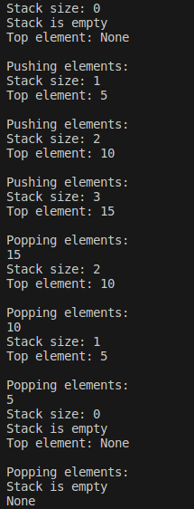
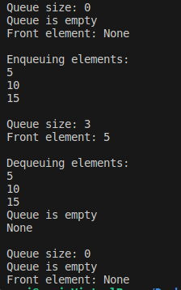
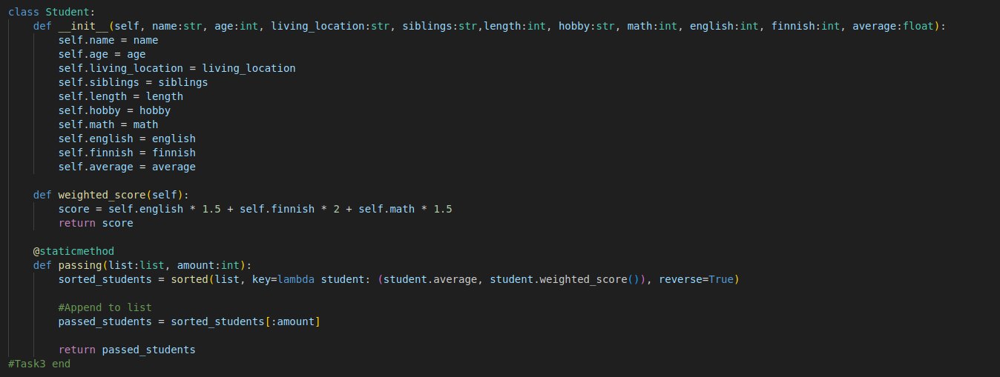
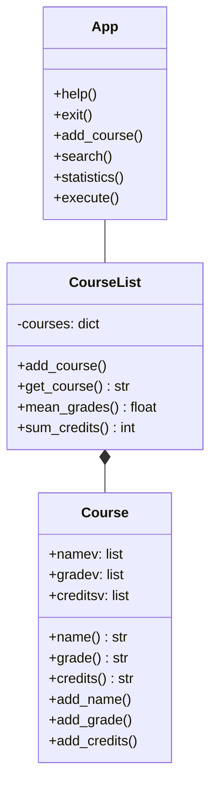
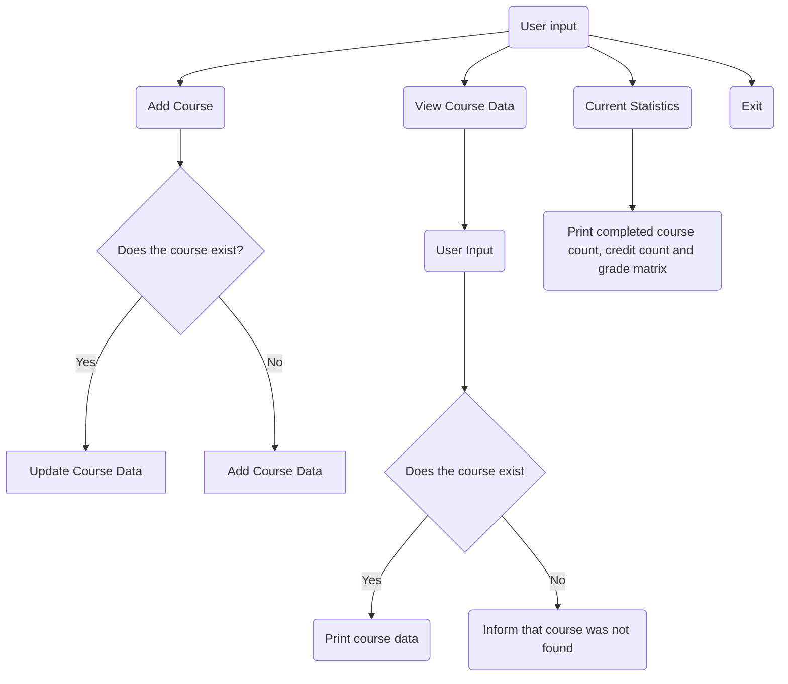

### Task 1

I implemented a python stack using collections.deque




#### Pros and Cons

Pros:

The solution is efficient as all the methods are of time complexity O(1). 

It contains all the common methods that are expected from a python stack data structure. 

The error handling is graceful, as runtime doesn't get interrupted just because the stack is empty. 

Deque also provides tools that allow the current implementation to be adapted for double-ended queue useage rather easily, if neccesary, providing flexibility.

Cons: 

Memory efficiency for small stacks is not as great as some of the simpler options such as a list-based implementation.

Current implementation has no type checking, or any sort of input verification.

Users have access to insert things to any position of the stack using push. This could lead to issues as users could potentially manipulate the stack by accessing arbitrary elements in the stack, leading to unexpected behaviour later down the line.

### Task 2

I implemented a python queue using collections.deque



#### Pros and Cons

Pros:

The solution is efficient as all the methods are of time complexity O(1). 

It contains all the common methods that are expected from a python queue data structure. 

The error handling is graceful, as runtime doesn't get interrupted just because the queue is empty (underflow handling). 

Users cannot insert things in middle of the queue, only at the beginning.

Cons: 

Users can still inspect what elements the queue contains.

Current implementation has no type checking, or any sort of input verification.

Memory efficiency for small queues is not as great as some of the simpler options such as a list-based implementation.

### Task 3
a) 
    name
    age
    living_location
    siblings
    length
    hobby
    math grade
    english grade
    finnish grade
    average grade

b) 
    The data can be stored as objects that are optionally stored in a list, but the objects will need int, float and str datatypes to properly contain all information present. Some of the data might be unneccesary to store from a schools perspective however, i.e. length, hobby, siblings.

c) 
    In terms of an applicant, all the neccesary data are the applicants name and their grades. Look at Task3 in code to look at an implementation solution to order them based on the task given. It first orders using average, and then sorts those with same average based on weighted score. They are sorted in a descending order and then appended to a list that is returned once the quota of passed students is reached.



d) 
    Perhaps a list , which then would be filled using an append function for the previous code. If we are purely interested in collection of applicants, appending students would be enough. You don't need a separate function to print the list, although it is a good programming practice to include it. Here's a solution for it:

```python
#Rest of the code as in above picture
class Student:
    students = []

    def __init__():
        #Everything as is

    @classmethod
    def add_student(self, student: 'Student'): #Forward declaration of class Student
        self.students.append(student)
```

The above code can be found in Exercise7.py. There is for certain useless information in the current solution, however if there is ever a need to use any of it for something, it is there.


### Task 4
1. 
    For this task, I chose something that I've already made using OOP. The purpose of the program is to create an application that stores and tracks users studies.

    It works off of a CLI, where there are three functional commands. One is to add a course (or edit a pre-existing course with same name, to update a grade in case of a retake), second is to fetch course data (runtime memory only), and third is to create a visual representation of grade distribution and shows current completed courses and the credit points accumulated.

    Lastly there is a command to exit the program cleanly.

2.  Changed diagram to mermaid diagram as it works in git better. Didn't know this diagram type existed in mermaid.
    



3. 
    The relevant code is associated in part5 under classes Course and CourseList.

4. 
    

#### As a side note for the code, I won't be editing it for the purposes of this demonstration. Some of the solutions are dirty in nature, however there were certain requirements in place when building the code leading to dirty solutions. Things that would make sense to be integers or floats were being taken as strings and then remapped, to name a few issues. Input verification is not in place.
5. 
    Code for the program :
```python
class Course:
    def __init__(self, name=None, grade=None, credits=None):
        self.namev = name if name is not None else []
        self.gradev = [grade] if grade is not None else []
        self.creditsv = [credits] if credits is not None else []
    
    def name(self):
        return self.namev if self.namev else ""
    
    def grade(self):
        return self.gradev[0] if self.gradev else None
    
    def credits(self):
        return self.creditsv[0] if self.creditsv else None
    
    def add_name(self, name):
        self.namev.append(name)

    def add_grade(self, grade):
        if self.gradev:
            if grade > self.gradev[0]:
                self.gradev[0] = grade
        else:
            self.gradev.append(grade)
    
    def add_credits(self, credit):
        if not self.creditsv:
            self.creditsv.append(credit)


class CourseList:
    def __init__(self):
        self.__courses = {}

    def add_course(self, name: str, grade: str, credits: str):
        if name not in self.__courses:
            course = Course(name)

            self.__courses[name] = course
        else:
            course = self.__courses[name]    

        course.add_grade(grade)
        
        
        course.add_credits(credits)

    
    def get_course(self, name: str):
        if not name in self.__courses:
            return None
        
        return self.__courses[name].grade(), self.__courses[name].credits()
    
    def mean_grades(self):
        all_grades = []
        for course in self.__courses.values():
            if isinstance(course.grade(), list):
                all_grades.extend(map(float, course.grade()))
            else:
                all_grades.append(float(course.grade()))  # Convert single grade to float

        if not all_grades:
            return None

        mean = sum(all_grades) / len(all_grades)
        return mean
    
    def sum_credits(self):
        sum_cred = 0

        for course in self.__courses.values():
            if isinstance(course.credits(), list):
                sum_cred += sum(map(int, course.credits()))
            else:
                sum_cred += int(course.credits())  # Convert single credit to int

        return sum_cred


class App:
    def __init__(self):
        self.__courselist = CourseList()
    
    def help(self):
        print("commands: ")
        print("0 exit")
        print("1 add course")
        print("2 get course data")
        print("3 statistics")
    
    def exit(self):
        exit()

    def add_course(self):
        name = input("Name of the course: ")


        if name in self.__courselist._CourseList__courses:
            grade_valid = False
            credits = 2 #Doesn't matter what is used here, it won't be used due to how add_course works in CourseList. Only provided so that last line won't give an error.
            while not grade_valid:
                try:
                    grade = int(input("grade: "))
                    if 0 <= grade <= 5:
                        grade_valid = True
                    else:
                        print("Invalid input. Grade must be between 0 & 5")
                except ValueError:
                    print("Invalid input, please enter a number between 0 & 5")


        else:    
            grade_valid = False
            while not grade_valid:
                try:
                    grade = int(input("grade: "))
                    if 0 <= grade <= 5:
                        grade_valid = True
                    else:
                        print("Invalid input. Grade must be between 0 & 5")
                except ValueError:
                    print("Invalid input, please enter a number between 0 & 5")

            cred_valid = False    
            while not cred_valid:
                try:
                    credits = int(input("credits: "))
                    if credits >= 0:
                        cred_valid = True
                    else:
                        print("Invalid input, credits must be above 0")
                except ValueError:
                    print("Invalid input, please enter an integer above 0")

        self.__courselist.add_course(name,grade,credits)
    
    def search(self):
        name = input("course: ")
        course_name = self.__courselist.get_course(name)

        if course_name is None:
            print("no entry for this course")
            return
        
        grades, credits = self.__courselist.get_course(name)
        print(f"{name} ({credits} cr) grade {grades}")
    
    def statistics(self):
        mean_grade = self.__courselist.mean_grades()
        credit_sum = self.__courselist.sum_credits()
        num_courses = len(self.__courselist._CourseList__courses)

        if mean_grade is not None:
            print("Mean: {:.2f}".format(mean_grade))
        else:
            print("No grades available")
        print(f"{format(num_courses)} completed courses, a total of {format(credit_sum)} credits")

        #Grade matrix
        print("\nGrade distribution:")
        for grade in range(5,0, -1):
            grade_count = sum(1 for course in self.__courselist._CourseList__courses.values() if grade == course.grade())
            print(f"{grade}:{'x' * grade_count}")

    def execute(self):
        self.help()
        while True:
            print("")
            command = input("command: ")
            if command == "0":
                self.exit()
                break
            elif command == "1":
                print("\n")
                self.add_course()
            elif command == "2":
                print("\n")
                self.search()
            elif command == "3":
                print("\n")
                self.statistics()
            else:
                print("\n")
                self.help()

alt = App()
alt.execute()

```


    