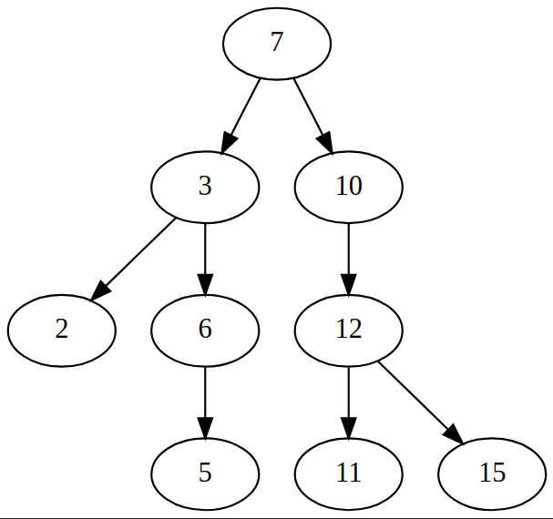

### Task 1



### Task 2


### Task 3


### Task 4

When deleting a leafnode, the structure remains the same with only the leaf being remove.

When deleting a node with one child, the child replaces the parent.

When deleting a node with two children, the right child replaces the deleted node and left child is now the sole child of the previously right child.

### Task 5

I completed task 5 in two separate methods. Its important to note that the list approach works because if you traverse the BST and mark the entire process down, the predecessor and successor are the elements before and after the element in question in the list.

List approach:
```python
    #Helper function for list approach
    def _inorder_traversal(self, current, result):
        if current is not None:
            if current.left is not None:
                self._inorder_traversal(current.left, result)
            result.append(current.value)
            if current.right is not None:
                self._inorder_traversal(current.right, result)
    
    #Another helper function for list approach
    def _inorder_traversal_list(self):
        if self.root is None:
            return []
        result = []
        self._inorder_traversal(self.root, result)
        return result
    
    def inorder_list(self, value, pred_or_succ):
        list = self._inorder_traversal_list()

        if pred_or_succ == "pred":
            for i in range(len(list)):
                if list[i] == value:
                    if i > 0:
                        return list[i - 1]
                    else:
                        return "No predecessor"
            print(f"no node with {value}")

        elif pred_or_succ == "succ":
            for i in range(len(list)):
                if list[i] == value:
                    if i < len(list) - 1:
                        return list[i + 1]
                    else:
                        return "No successor"
            print(f"No node with {value}")

        else:
            print("Invalid argument on pred || succ")

```

Regular approach:
```python
    def inorder_predecessor(self, node, value):
        predecessor = None
        while node is not None:
            if node.value == value:
                if node.left is not None:
                    predecessor = node.left
                    while predecessor.right is not None:
                        predecessor = predecessor.right
                break
            elif node.value < value:
                predecessor = node
                node = node.right
            else:
                node = node.left
        
        if predecessor is not None:
            return predecessor.value
        else:
            return "No predecessor"
    
    def inorder_successor(self, node, value):
        succ = None
        while node is not None:
            if node.value == value:
                if node.right is not None:
                    succ = node.right
                    while succ.left is not None:
                        succ = succ.left
                break
            elif node.value < value:
                node = node.right
            else:
                succ = node
                node = node.left
        
        if succ is not None:
            return succ.value
        else:
            return "No successor"

```