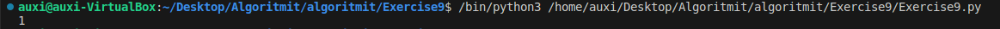
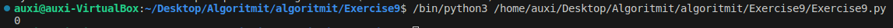
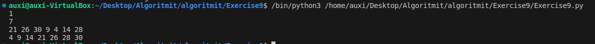
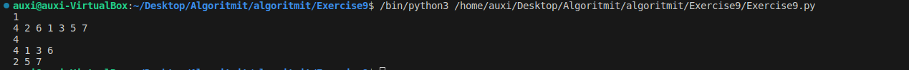
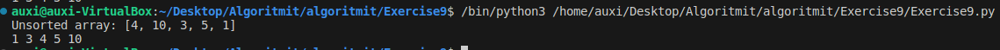

### Task 1 
```python
#Test case
test_variable = "2 1 3" #Task 1
```


### Task 2
```python
#Test case
test_task2 = "1 2 3 N N 4 6 N 5 N N 7 N" #Task 2
```


### Task 3 
#### Insertion
Explanation of lines : 

Amount of tests

Amount of items to add 

keys to items to add

output with items sorted

#### Deletion
Explanation of lines : 

Amount of tests

keys of items added to AVL

amount of items to delete

keys for items to delete

sorted output with deleted items no longer present

items sorted


### Task 4 
