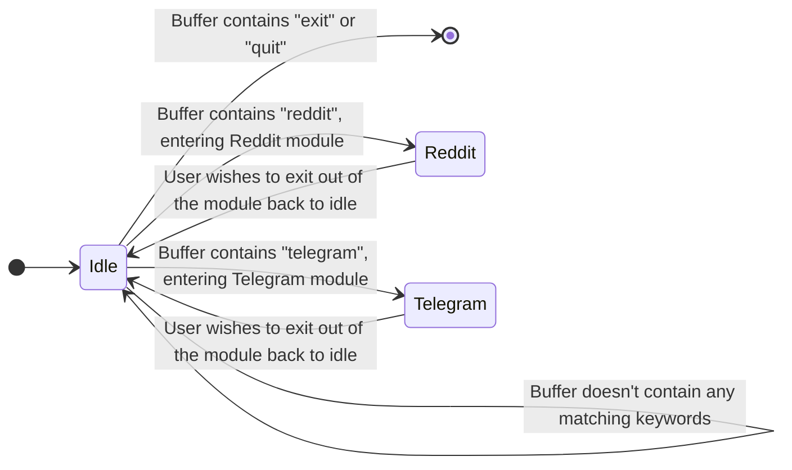
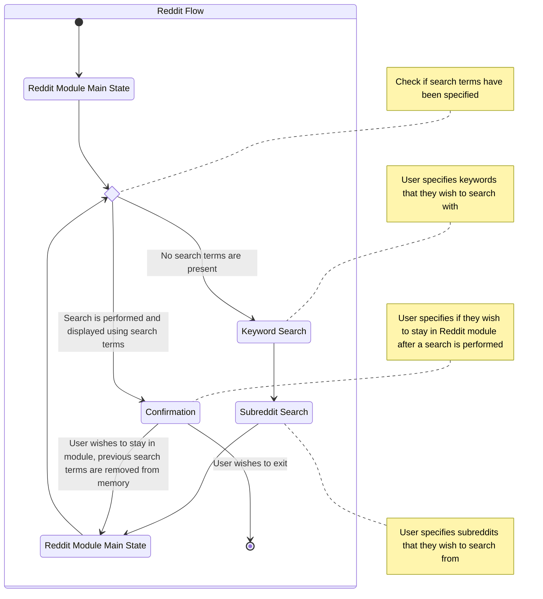
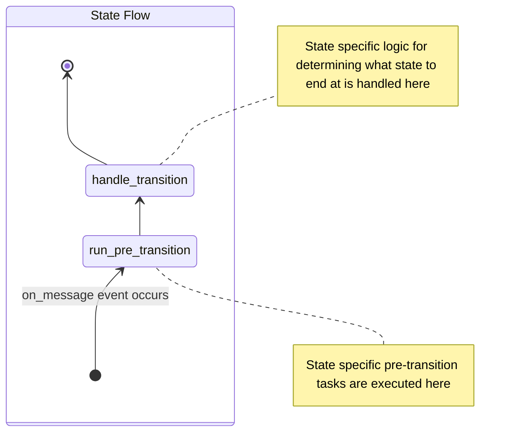
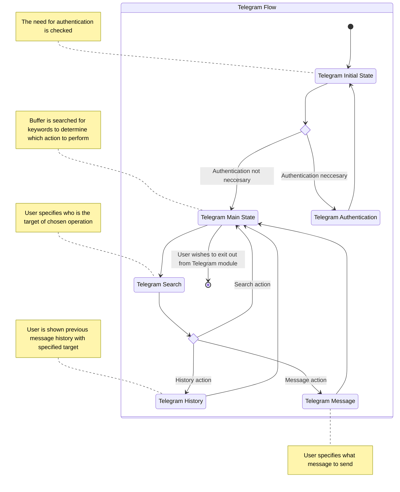
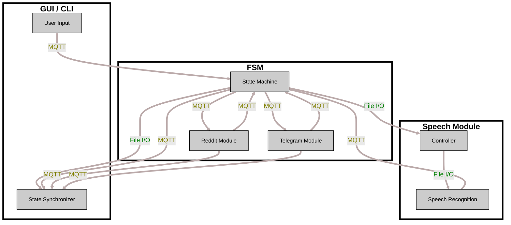

- Functional Requirements
  - Speech Interface
  - Visual, Auditory or Audiovisual User Feedback
  - GUI or CLI

- Non-Functional Requiremens
  - Privacy
  - Performance
  - Security
  - Locality
  - Extensibility
  - Maintainability
  - Portability
  - Developer Experience

- Technical Requirements
  - Hardware Components
  - System Architecture
  - Platform Integration
  - Development Tools