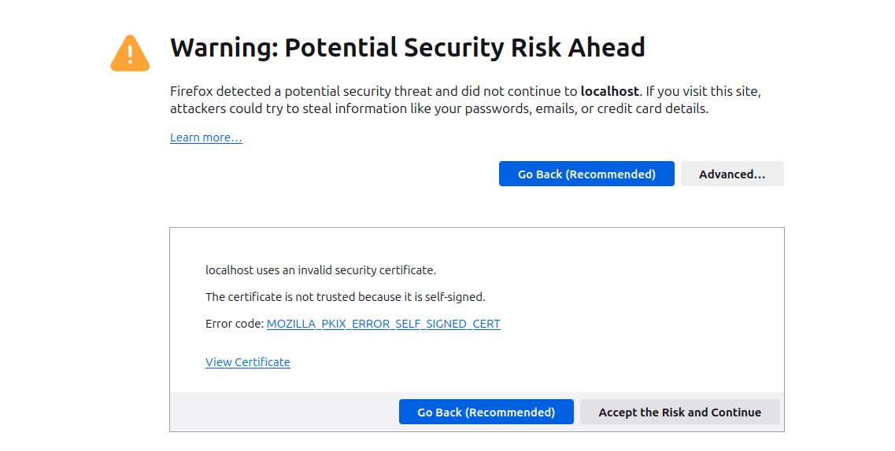

# Task 1

## Enabling ufw

## Nginx default page

## Uncertified connection through HTTPS

## Self-signed connection through HTTPS

## Certificate screenshots

# Task 2
The purpose of CA's is to act as a voucher for any given entity. So in essence, if you trust the CA issuing the certificate to not have bad actors (or very minimal amount of them and they are being consistently removed when found), you should also be able to trust that your connection with any entities that are signed by that CA to be secure.
