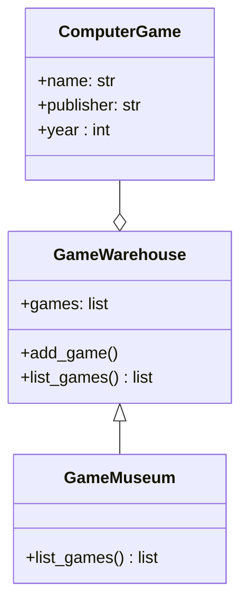

```mermaid
classDiagram

    class ComputerGame{
        +name: str
        +publisher: str
        +year : int
    }

    class GameWarehouse{
        +games: list
        +add_game()
        +list_games() list
    }

    class GameMuseum{
        +list_games() list
    }

    ComputerGame --o GameWarehouse
    GameWarehouse <|--  GameMuseum

```
