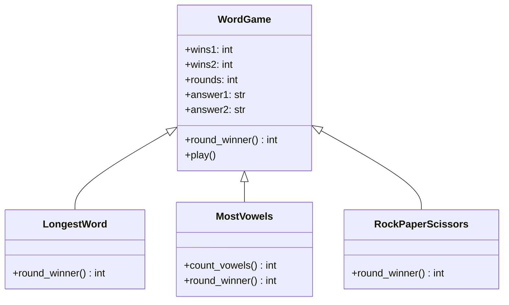

```mermaid
classDiagram

    class WordGame{
        +wins1: int
        +wins2: int
        +rounds: int
        +answer1: str
        +answer2: str
        +round_winner() int
        +play()
    }

    class LongestWord{
        +round_winner() int
    }

    class MostVowels{
        +count_vowels() int
        +round_winner() int
    }

    class RockPaperScissors{
        +round_winner() int
    }

    WordGame <|-- LongestWord
    WordGame <|-- MostVowels
    WordGame <|-- RockPaperScissors

```