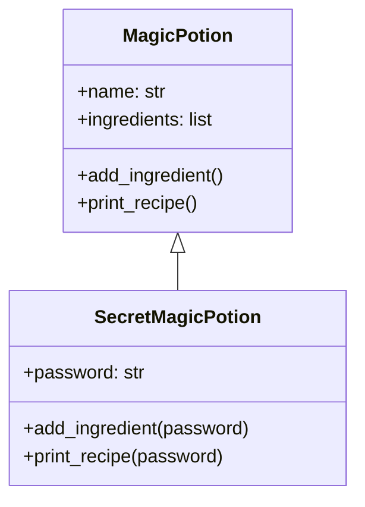

```mermaid
classDiagram

    class MagicPotion{
        +name: str
        +ingredients: list
        +add_ingredient()
        +print_recipe()
    }

    class SecretMagicPotion{
        +password: str
        +add_ingredient(password)
        +print_recipe(password)
    }

    MagicPotion <|-- SecretMagicPotion

```