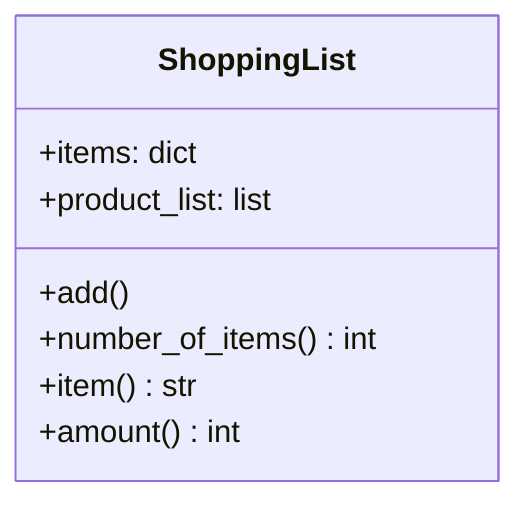

```mermaid
classDiagram

    class ShoppingList{
        +items: dict
        +product_list: list
        +add()
        +number_of_items() int
        +item()str
        +amount()int
    

    }

```