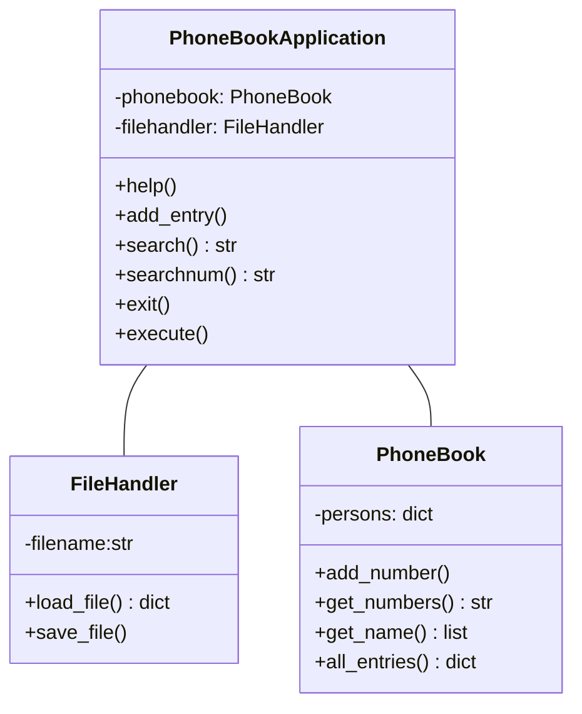

```mermaid
classDiagram

    class PhoneBook{
        -persons: dict
        +add_number()
        +get_numbers() str
        +get_name()list
        +all_entries()dict
    }

    class PhoneBookApplication{
        -phonebook: PhoneBook
        -filehandler: FileHandler
        +help()
        +add_entry()
        +search()str
        +searchnum()str
        +exit()
        +execute()
    }

    class FileHandler{
        -filename:str
        +load_file()dict
        +save_file()
    }

    PhoneBookApplication -- FileHandler
    PhoneBookApplication -- PhoneBook

```