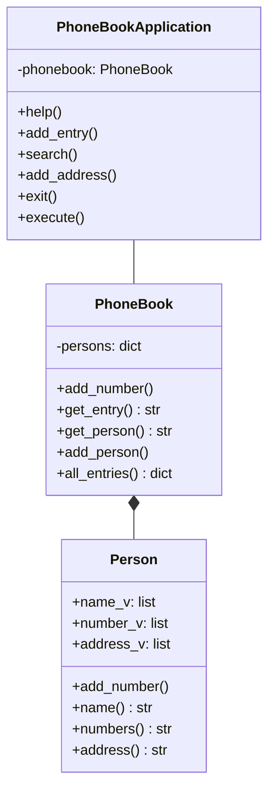

```mermaid
classDiagram

    class Person{
        +name_v: list
        +number_v: list
        +address_v: list
        +add_number()
        +name()str
        +numbers()str
        +address()str
    }

    class PhoneBook{
        -persons: dict
        +add_number()
        +get_entry()str
        +get_person()str
        +add_person()
        +all_entries()dict
    }

    class PhoneBookApplication{
        -phonebook: PhoneBook
        +help()
        +add_entry()
        +search()
        +add_address()
        +exit()
        +execute()
    }

    PhoneBook *-- Person
    PhoneBookApplication -- PhoneBook
```