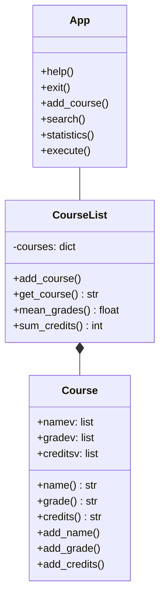

```mermaid
classDiagram

    class Course{
        +namev: list
        +gradev: list
        +creditsv: list
        +name() str
        +grade() str
        +credits() str
        +add_name()
        +add_grade()
        +add_credits()
    }

    class CourseList{
        -courses: dict
        +add_course()
        +get_course()str
        +mean_grades()float
        +sum_credits()int
    }

    class App{
        +help()
        +exit()
        +add_course()
        +search()
        +statistics()
        +execute()
    }

    App -- CourseList
    CourseList *-- Course

```