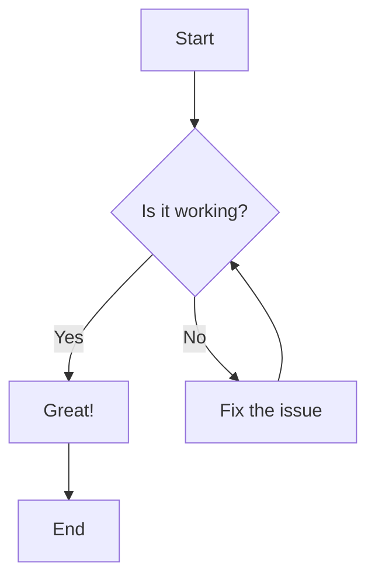

## Testing big

- testing smol
- testing smol2

# Note to self : DO NOT WORK ON MERMAID GRAPHS OFF OF CLI. IT IS HORRIBLE WASTE OF TIME, USE VSCODE INSTEAD OF NEOVIM FOR THIS. Or make your own plugin that isn't a bigger mess. Or figure out a better alternative. DO NOT USE NEOVIM FOR GRAPHS.
## Using neovim for pure text is fine (:Glow)

### Todo
- CLI command map
- Password to account linker (encrypted passwords matching non-encrypted accounts in the event of entries not being synced up due to manual interferance to stored data)
- Encryption
- Import / Export
- App
- Unit tests for id based append & remove functions
- Handle file not found (better than panicing)
- Store passwords separately
- RSA autogen (and/or allow provision of id_rsa.pub)
- Fix exact length name generator logic (doesn't pass tests 100% of time)
- Add RSA field to config
### Done
- URLsafe password generation with given length
- Random account handle generation (for login purposes), can be expanded
- Some unit tests on name gen & password gen (some edge cases missing? who knows)
- 1 function that generates all neccesities for an account (password, name generated, email and id prompted)
- prompt id remove entries from json file
- default config for length parameters
- autogen config if file corrupt / missing
- config unit tests
- default config getters 
